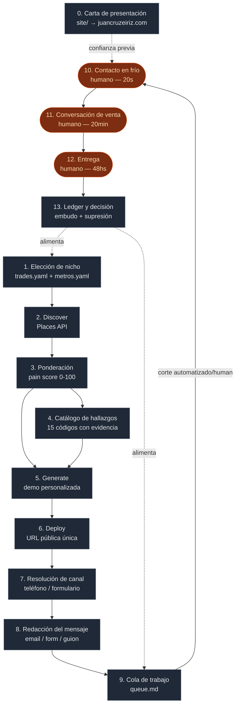
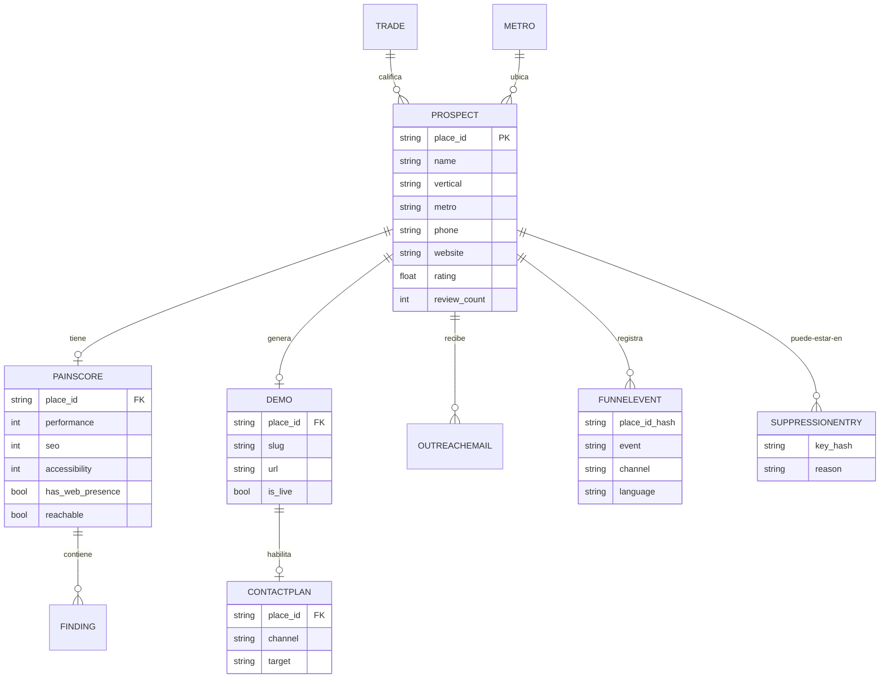
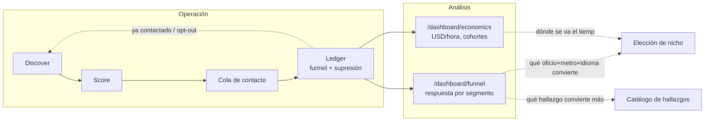

# Mapa de procesos — tech-services-arg

Este documento existe porque el negocio ya está construido en código (`gtm/`), pero el código
solo prueba que las etapas funcionan — no dice **por qué** se cortó en 50 reseñas, **por qué**
el pain score corta en 45, o **qué pasa** si se saca un nodo. Ese es el propósito de este mapa:
poder señalar cualquier pata de la operación y decir qué hace, cómo lo hace, y para qué existe.

Se lee junto a [`docs/PLAN_DIARIO.md`](PLAN_DIARIO.md), que es el plan de 20 sesiones de
30-60 min para entenderlo (Fase A), debuggearlo (Fase B) y cerrarlo (Fase C) antes de arrancar
el experimento pre-registrado de [`gtm/decision_criteria.yaml`](../gtm/decision_criteria.yaml).

Cada nodo se lee: **qué** hace → **cómo** lo hace → **para qué** existe. Ese es el orden pedido,
y es deliberado: entender el mecanismo antes de opinar sobre él evita la trampa más común de
iterar un sistema que todavía no se terminó de leer.

---

## Diagrama 1 — Grafo maestro

Catorce nodos. La línea punteada marca el corte real de la operación: todo lo de arriba lo
automatiza el código; todo lo de abajo lo hace una persona (vos), a propósito — es la decisión
de diseño central del pipeline (ver [`gtm/README.md`](../gtm/README.md#por-qué-existe)).

| # | Nodo | Dónde vive | Qué decide |
|---|---|---|---|
| 0 | Carta de presentación | `site/` → juancruzeiriz.com | Lo que ven cuando te googlean. No es parte del pipeline: es el nodo de confianza del que cuelgan todos los demás |
| 1 | Elección de nicho | `gtm/catalog/trades.yaml`, `metros.yaml` | `rank` de oficio = ticket × peso de urgencia; `rank` de metro = población × %hispano ÷ 1.5 si hay riesgo mini-TCPA |
| 2 | Discover | `gtm/factory/discover.py` | Google Places API. Filtro: ≥50 reseñas, ≥4.0 rating, con teléfono. Orden: sin sitio primero |
| 3 | Ponderación (pain score) | `gtm/factory/score.py` + `PainScore.score` en `types.py` | PageSpeed + CrUX + forensics HTML + Wayback → 5 dimensiones combinadas con OR ruidoso. Corte `is_qualified`: score ≥ 45 |
| 4 | Catálogo de hallazgos | `gtm/factory/findings.py` (15 códigos) | Cada defecto detectable lleva su evidencia citable y su línea de venta en EN/ES |
| 5 | Generate | `gtm/factory/generate.py`, `gtm/template/site.html` | Renderiza la demo con datos reales del negocio. `noindex`, marcada como preview de terceros |
| 6 | Deploy | `gtm/factory/deploy.py` | Copia al directorio publicable y asigna URL única. Sin URL viva no hay pitch |
| 7 | Resolución de canal | `gtm/factory/contact.py::resolve_contact` | Sin sitio propio → teléfono (mayor dolor). Con sitio → busca formulario de contacto. Nunca email scrapeado, nunca SMS en frío |
| 8 | Redacción del mensaje | `outreach.py::build_body`, `contact.py::build_form_message`/`build_call_script` | Tres formatos distintos para tres canales. El email se valida contra CAN-SPAM al construirse |
| 9 | Cola de trabajo | `contact.py::render_queue` → `gtm/build/queue.md`, `/queue` en la UI | El pipeline **prepara, no envía**. Cola ordenada por dolor descendente |
| 10 | Contacto en frío | Humano — guion en `pipeline.md` | Llamada de 20 segundos. Objetivo único: permiso para mandar el link por SMS |
| 11 | Conversación de venta | Humano — guion de 20 min en `pipeline.md` | No es demo del producto: confirmar que el dolor existe y hay presupuesto. Precio recién al final |
| 12 | Entrega | Humano — 48 hs | Apuntar el dominio + configurar el proveedor de missed-call-text-back |
| 13 | Ledger y decisión | `gtm/factory/ledger.py`, `decision_criteria.yaml`, `/dashboard/*` | Embudo de 5 niveles + lista de supresión, ambos persistidos como hash. Ganador: 1 venta cobrada. Kill: 200 contactados, 0 ventas, <5 respuestas |

---

## Diagrama 2 — DER de datos

Todo se encadena por `Prospect.place_id`, el ID estable que devuelve Google Places. Fuente:
[`gtm/factory/types.py`](../gtm/factory/types.py).

`FUNNELEVENT` y `SUPPRESSIONENTRY` guardan **solo hashes SHA-256** de `place_id`/teléfono/dominio
normalizados, nunca el dato de contacto — es la regla que permite que `funnel.jsonl` y
`suppression.jsonl` vivan en git (ver [`gtm/README.md`](../gtm/README.md#reglas-que-el-código-hace-cumplir)).

---

## Diagrama 3 — Bucles de realimentación

Esto es lo que hoy **no está dibujado en ningún lado** — y por eso es donde viven la mayoría de
las oportunidades de mejora que busca la Fase B del plan diario.

Tres bucles concretos:

1. **Supresión → discover.** Un `place_id` ya contactado o que pidió baja nunca vuelve a
   aparecer en una corrida nueva — se filtra en `contact.py::main` antes de llegar a la cola.
2. **Embudo → elección de nicho.** `/dashboard/economics` correlaciona dolor↔conversión por
   cohorte (oficio×metro×idioma). Es la única fuente legítima para cambiar de nicho — nunca una
   corazonada a mitad del experimento.
3. **Embudo → catálogo de hallazgos.** Si un hallazgo nunca aparece en el pain_score de los que
   sí convierten, es candidato a bajar de peso o sacar — pero esto es una lectura *posterior* al
   cierre del experimento, no algo para tocar en caliente (viola `regla_dura`).

---

## Fichas de nodo

Plantilla fija. **Problemas conocidos** y **Bitácora** arrancan vacíos a propósito — se llenan
durante la Fase B del [plan diario](PLAN_DIARIO.md), con hipótesis falsables, no opiniones.

### 0. Carta de presentación

**Qué** — El sitio propio (juancruzeiriz.com) y el perfil que un prospecto encuentra si te
googlea antes de contestar.

**Cómo** — Astro estático, `site/src/`. Deploy a GitHub Pages vía Actions, dominio propio con
HTTPS en Cloudflare (DNS only, no proxied).

**Para qué** — Es el mecanismo #5 de "resolver la falta de marca" en `pipeline.md`: presencia
verificable. Sin esto, el prospecto que googlea antes de responder no encuentra nada y el
mensaje pierde credibilidad.

**Palancas** — Copy de "Sobre mí", certificaciones mostradas, CV descargable, nav mobile, tema
activo (dark/light/cream), loader de intro.

**Problemas conocidos** — Auditoría del Día 2 (2026-08-05). Tres hipótesis, verificadas por
medición en vivo antes de tocar código — no por opinión:

1. **Bug de layout en `/servicios/`, confirmado.** `.services-detail-list li` (selector
   descendiente) atrapaba también los `<li>` de la lista de stack anidada dentro de cada fila.
   Medido: el chip "Python" medía 97×59px con `grid-template-columns: 56px 0px` — texto en una
   columna de 0px de ancho. 21 chips afectados en las 4 rutas del catálogo. **Resuelto** en
   `fix(site): chips de stack rotos...` — combinador de hijo directo (`>`).
2. **"Nada se mueve", parcialmente un bug y parcialmente diseño.** Medido en producción:
   `prefers-reduced-motion` estaba activo y la regla `*, *::before, *::after
   { animation-duration: 0.01ms !important }` apagaba *todo* el movimiento, no solo el
   vestibular — más de lo que pide la accesibilidad (WCAG 2.3.3 habla de parallax/desplazamientos
   grandes, no de un simple fundido). **Resuelto**: reduced-motion ahora conserva el fade de
   opacidad y solo mata `transform`/animaciones ambientales (`data-motion="ambient"`).
3. **Aun con el movimiento activo, era imperceptible.** Blobs de 22-28s de período y reveals de
   `translateY(1.2rem)` no se notan en la ventana de atención real de un visitante. **Resuelto**:
   blobs a 13-16s con más amplitud, reveals a `translateY(2.2rem) + scale`, stagger real vía
   `--i` en las grillas (Certifications/Services/StatsBand/ProjectCard), más loader de intro,
   tercer tema, blobs con parallax de mouse, transiciones SPA entre páginas, barra de progreso de
   lectura y contadores que cuentan hacia arriba.

**Oportunidad identificada, no resuelta todavía**: el marquee de servicios podría reaccionar a la
velocidad/dirección del scroll en vez de tener una velocidad fija — quedó fuera de esta sesión
por relación costo/beneficio (la ganancia era la más chica de toda la lista).

**Bitácora** —

- **2026-08-05** — Fix de layout en `/servicios/` (Fase 0). Reduced-motion matizado + intensidad
  de reveals/blobs subida (Fase 1). Tercer tema "cream" con contraste WCAG AA calculado, no a
  ojo — el primer valor de acento elegido daba 3.80:1, insuficiente (Fase 3b). Loader de intro
  con grilla de bits 0/1, diseñado para degradar a "no mostrar nunca" si el script falla, nunca a
  "overlay trabado para siempre" (Fase 3a). `<ClientRouter />` + parallax de mouse en los blobs +
  barra de progreso de lectura (CSS puro) + contadores animados en StatsBand (Fase 3c).

---

### 1. Elección de nicho

**Qué** — Elegir un par oficio × metro antes de correr nada.

**Cómo** — `gtm/catalog/trades.yaml` (rank = `avg_ticket_usd` × peso de urgencia: alto=3,
medio=2, bajo=1, ascendente = mejor primero); `gtm/catalog/metros.yaml` (rank = población ×
%hispano/100 ÷ 1.5 si `mini_tcpa_risk`, descendente = mejor primero).

**Para qué** — Es la decisión de apalancamiento más importante del negocio: el mismo template
sirve a todos los prospectos del par elegido, el costo marginal por demo tiende a cero. Elegir
mal acá invalida todo lo que sigue.

**Palancas** — Qué oficio, qué metro, umbral de reseñas/rating aguas abajo en discover.

**Problemas conocidos** —

**Bitácora** —

---

### 2. Discover

**Qué** — Encontrar negocios candidatos del par oficio×metro elegido.

**Cómo** — `gtm/factory/discover.py::discover`. Google Places API (New), `textQuery`, hasta 5
páginas. Filtra por `MIN_REVIEWS=50`, `MIN_RATING=4.0`, requiere teléfono. Ordena sin-sitio
primero, después por reseñas descendente.

**Para qué** — El cruce reseñas-altas + rating-alto + web-pobre es el prospecto ideal: tiene
plata, le importa su reputación, y su web no está a la altura — no está peleando por sobrevivir.

**Palancas** — `MIN_REVIEWS`, `MIN_RATING`, `--limit`.

**Problemas conocidos** —

**Bitácora** —

---

### 3. Ponderación (pain score)

**Qué** — Medir cuánto le duele a cada prospecto su presencia digital actual, en una escala
0-100.

**Cómo** — `gtm/factory/score.py::score_prospect` orquesta PageSpeed Insights (Lighthouse
mobile), CrUX (datos de campo reales), forensics sobre el HTML crudo y última fecha de cambio
real (Wayback CDX). `PainScore.score` en `types.py` combina 5 dimensiones (conversion 2.0,
speed 1.5, mobile 1.5, seo 1.0, modernity 0.8) con **OR ruidoso** por dimensión — dos hallazgos
en la misma dimensión duelen más que uno solo, nunca se promedian entre sí. Sin sitio = 100
automático. Sitio caído = 95. `is_qualified` corta en `score >= 45`.

**Para qué** — Es el filtro que decide en qué prospecto vale la pena gastar el costo (bajo pero
no cero) de generar una demo. Sin esto, se generarían demos parejo para negocios que ya tienen
web decente, quemando tiempo sin mejorar la tasa de respuesta.

**Palancas** — Los 5 pesos de dimensión, el corte de 45, `MIN_REVIEWS`/`MIN_RATING` aguas
arriba que determinan qué llega a puntuarse.

**Problemas conocidos** —

**Bitácora** —

---

### 4. Catálogo de hallazgos

**Qué** — El diccionario de 15 defectos detectables, cada uno con severidad, dimensión, peso, y
su frase de venta en inglés y español.

**Cómo** — `gtm/factory/findings.py::FINDINGS`. Cada `Finding` concreto lleva evidencia citable
(un número, una fecha, una etiqueta encontrada) — nunca una afirmación sin dato detrás.
`PainScore.sales_lines()` los ordena del más grave al menos grave.

**Para qué** — Es lo que convierte un score abstracto en una frase que un dueño de negocio
puede verificar él mismo en el momento ("tu sitio no cambia desde marzo de 2016"). Sin evidencia
citable, el gancho es indistinguible del spam genérico que ya descartaron veinte veces.

**Palancas** — El texto de cada `sales_line_en`/`sales_line_es`, el peso de cada hallazgo.

**Problemas conocidos** —

**Bitácora** —

---

### 5. Generate

**Qué** — Renderizar la demo personalizada del negocio.

**Cómo** — `gtm/factory/generate.py` + `gtm/template/site.html`. Usa nombre, teléfono, rating,
reseñas (agregado, no texto — restricción de licencia de Google Maps Platform), ciudad y
servicios del catálogo (`gtm/catalog`). Se marca con `noindex` y como preview de terceros.

**Para qué** — Es el artefacto que reemplaza a la marca: el prospecto no tiene que creer nada,
lo abre y lo ve. Solo es viable como estrategia si generar el artefacto es casi gratis — por
eso toda la automatización está acá y no en la entrega.

**Palancas** — Copy por vertical en `trades.yaml`, plantilla HTML, servicios default cuando el
vertical no está en catálogo.

**Problemas conocidos** —

**Bitácora** —

---

### 6. Deploy

**Qué** — Publicar la demo en una URL pública única y estable.

**Cómo** — `gtm/factory/deploy.py::deploy`. Copia a `gtm/public/<slug>/`, listo para
`wrangler pages deploy`. El directorio está fuera de git (datos de contacto de negocios reales).

**Para qué** — Un mockup adjunto no es prueba de trabajo. Sin URL viva, `outreach.py` rechaza
directamente el email — es una regla dura, no una convención.

**Palancas** — `GTM_DEMO_BASE_URL`, el dominio donde se publica.

**Problemas conocidos** —

**Bitácora** —

---

### 7. Resolución de canal

**Qué** — Decidir por qué canal se contacta a cada prospecto: Google Places no da emails.

**Cómo** — `gtm/factory/contact.py::resolve_contact`. Sin sitio propio (o solo redes) → teléfono
si hay, si no `UNREACHABLE`. Con sitio → busca `<form>` con textarea o campo de email, rankeado
por palabras clave (`request-a-quote` convierte mejor que `contact-us`). Sin formulario
ubicable pero con teléfono → teléfono igual.

**Para qué** — La asignación de canal sigue al pain score a propósito: los de mayor dolor no
tienen sitio, así que no tienen formulario, pero sí teléfono, y son pocos — manejable a mano.

**Palancas** — `_FORM_HINTS` y su orden de prioridad, `--no-probe`.

**Problemas conocidos** —

**Bitácora** —

---

### 8. Redacción del mensaje

**Qué** — Escribir el texto real que ve el prospecto, en el formato del canal resuelto.

**Cómo** — Tres builders: `outreach.py::build_body` (email, con validación CAN-SPAM
obligatoria), `contact.py::build_form_message` (≤600 caracteres, sin firma ni dirección postal),
`contact.py::build_call_script` (guion de 20 s). El gancho de "llamada perdida" **solo** se
renderiza si hay una `missed_call_at` real registrada — si no, cae al ángulo medido por
Lighthouse.

**Para qué** — El orden importa: primero el hecho observado, después el link, recién al final
el precio. Si el precio va arriba, se lee como publicidad. Y nunca se inventa un hecho: el
primer teléfono que atiendan destruye la venta y la reputación.

**Palancas** — El texto de los tres templates, `price_usd`, `language`.

**Problemas conocidos** —

**Bitácora** —

---

### 9. Cola de trabajo

**Qué** — La lista concreta y ordenada de a quién contactar, cómo y con qué mensaje.

**Cómo** — `contact.py::render_queue` → `gtm/build/queue.md`, también disponible en `/queue` de
la UI. Ordenada por `pain_score` descendente, separada en Llamadas / Formularios / Descartados.

**Para qué** — Decisión de diseño central: **el pipeline prepara, no envía.** A 25 prospectos
por semana, mandar a mano cuesta hora y media, convierte más, y evita de raíz el harvesting de
direcciones (CAN-SPAM agravado) y el SMS en frío (TCPA).

**Palancas** — Ninguna propia — hereda todo de los nodos 7 y 8.

**Problemas conocidos** —

**Bitácora** —

---

### 10. Contacto en frío

**Qué** — El primer contacto humano real: la llamada de apertura.

**Cómo** — Guion de 20 segundos en [`pipeline.md`](../gtm/pipeline.md#guion-de-apertura--llamada-en-frío-20-segundos),
también implementado en `contact.py::build_call_script` — si se retoca uno, retocar el otro.

**Para qué** — Objetivo único: permiso para mandar el link por SMS. No es venta, no es la demo,
no son 20 minutos. Bajar la barrera de entrada al mínimo posible.

**Palancas** — El guion en sí (EN/ES).

**Problemas conocidos** —

**Bitácora** —

---

### 11. Conversación de venta

**Qué** — La llamada de 20 minutos que se agenda después de que respondieron al link.

**Cómo** — Guion de 6 pasos en `pipeline.md`: dejar que el dueño describa cómo le llegan los
trabajos, que él mismo diga qué pasa cuando se le escapa una llamada, cuantificar el valor de un
trabajo típico, cuántas llamadas se le escapan por semana, multiplicar en voz alta delante suyo,
y recién ahí precio/plazo/garantía.

**Para qué** — No es una demo del producto: es confirmar que el dolor existe y que hay
presupuesto. Si el número del paso 5 da menos de USD 950, el prospecto está mal elegido — hay
que volver al discovery, no bajar el precio.

**Palancas** — El guion, las respuestas a objeciones documentadas en `validation.md`.

**Problemas conocidos** —

**Bitácora** —

---

### 12. Entrega

**Qué** — Apuntar el sitio al dominio del cliente y configurar el bot de texto automático.

**Cómo** — Plazo contractual de 48 horas. El bot **no se construye**: se configura un proveedor
existente de AI receptionist / missed-call-text-back (USD 25-50/mes) con la info real del
negocio.

**Para qué** — El margen está en la instalación, no en el software. Construir el bot propio
significa heredar guardias 24/7, incompatible con 5-10 hs semanales.

**Palancas** — Qué proveedor de SMS/bot se usa, el contrato (cláusulas mínimas en `pipeline.md`).

**Problemas conocidos** —

**Bitácora** —

---

### 13. Ledger y decisión

**Qué** — Registrar cada evento del embudo y cada supresión, de forma persistente entre
corridas, y leer contra el criterio pre-registrado.

**Cómo** — `gtm/factory/ledger.py`. `funnel.jsonl` (5 niveles: contacted → replied →
call_booked → proposal_sent → paid) y `suppression.jsonl`, ambos JSONL append-only con solo
hashes SHA-256. El criterio vive en `decision_criteria.yaml` y `tests/gtm/test_ledger_criteria.py`
falla si el código se aparta de esos umbrales.

**Para qué** — Es la única defensa contra el sesgo de "encontrar una lectura que justifica
seguir": ganador = 1 venta cobrada; kill = 200 contactados, 0 ventas, <5 respuestas. El archivo
no se toca durante el experimento — si el criterio resulta mal calibrado, es un resultado, no
un bug.

**Palancas** — Ninguna durante el experimento — es la regla dura. Se ajusta solo entre
experimentos, y con el hash del commit como prueba de que fue antes de ver datos.

**Problemas conocidos** —

**Bitácora** —

---

## Documentos relacionados

- [`gtm/pipeline.md`](../gtm/pipeline.md) — precios, guiones de venta, secuencia, contrato
- [`gtm/decision_criteria.yaml`](../gtm/decision_criteria.yaml) — criterio de kill pre-registrado
- [`gtm/validation.md`](../gtm/validation.md) — investigación de mercado externa, objeciones
- [`gtm/plan_aprendizaje.md`](../gtm/plan_aprendizaje.md) — plan semanal previo, sigue vigente en paralelo
- [`docs/WHY.md`](WHY.md) — por qué home services, por qué USA
- [`docs/CHANNELS.md`](CHANNELS.md) — por qué no hay WhatsApp/Telegram/SMS en frío
- [`docs/PLAN_DIARIO.md`](PLAN_DIARIO.md) — las 20 sesiones para recorrer este mapa
