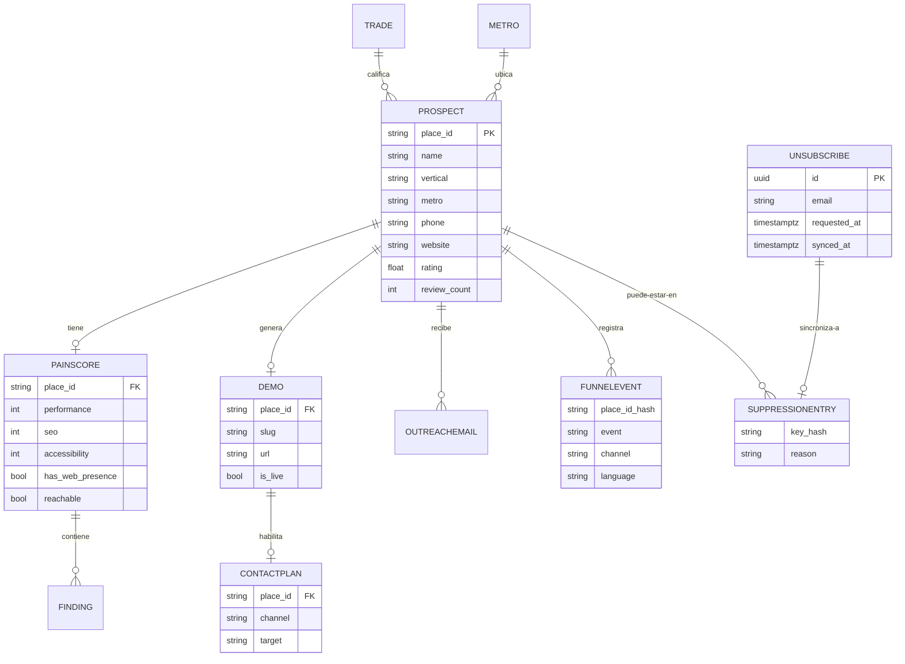
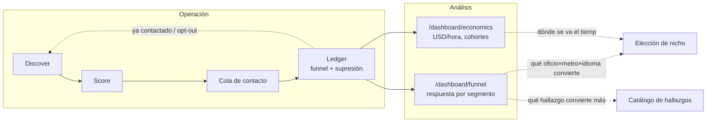

# Mapa de procesos — tech-services-arg

Este documento existe porque el negocio ya está construido en código (`gtm/`), pero el código
solo prueba que las etapas funcionan — no dice **por qué** se cortó en 50 reseñas, **por qué**
el pain score corta en 45, o **qué pasa** si se saca un nodo. Ese es el propósito de este mapa:
poder señalar cualquier pata de la operación y decir qué hace, cómo lo hace, y para qué existe.

Se lee junto a [`docs/PLAN_DIARIO.md`](PLAN_DIARIO.md), que es el plan de 20 sesiones de
30-60 min para entenderlo (Fase A), debuggearlo (Fase B) y cerrarlo (Fase C) antes de arrancar
el experimento pre-registrado de [`gtm/decision_criteria.yaml`](../gtm/decision_criteria.yaml).

Cada nodo se lee: **qué** hace → **cómo** lo hace → **para qué** existe. Ese es el orden pedido,
y es deliberado: entender el mecanismo antes de opinar sobre él evita la trampa más común de
iterar un sistema que todavía no se terminó de leer.

---

## Diagrama 1 — Grafo maestro

Catorce nodos. La línea punteada marca el corte real de la operación: todo lo de arriba lo
automatiza el código; todo lo de abajo lo hace una persona (vos), a propósito — es la decisión
de diseño central del pipeline (ver [`gtm/README.md`](../gtm/README.md#por-qué-existe)).

| # | Nodo | Dónde vive | Qué decide |
|---|---|---|---|
| 0 | Carta de presentación | `site/` → juancruzeiriz.com | Lo que ven cuando te googlean. No es parte del pipeline: es el nodo de confianza del que cuelgan todos los demás |
| 1 | Elección de nicho | `gtm/catalog/trades.yaml`, `metros.yaml` | `rank` de oficio = ticket × peso de urgencia; `rank` de metro = población × %hispano ÷ 1.5 si hay riesgo mini-TCPA |
| 2 | Discover | `gtm/factory/discover.py` | Google Places API. Filtro: ≥50 reseñas, ≥4.0 rating, con teléfono. Orden: sin sitio primero |
| 3 | Ponderación (pain score) | `gtm/factory/score.py` + `PainScore.score` en `types.py` | PageSpeed + CrUX + forensics HTML + Wayback → 5 dimensiones combinadas con OR ruidoso. Corte `is_qualified`: score ≥ 45. Antes de asignar dolor 100 por "sin sitio", `verify.py` (Día 8) corrobora contra un dominio derivado del nombre — sin eso, un negocio con dominio propio no vinculado en Maps recibía un email diciendo "no tenés sitio", falso y verificable en la primera llamada |
| 4 | Catálogo de hallazgos | `gtm/factory/findings.py` (15 códigos) | Cada defecto detectable lleva su evidencia citable y su línea de venta en EN/ES |
| 5 | Generate | `gtm/factory/generate.py`, `gtm/template/site.html` | Renderiza la demo con datos reales del negocio. `noindex`, marcada como preview de terceros |
| 6 | Deploy | `gtm/factory/deploy.py` | Copia al directorio publicable y asigna URL única. Sin URL viva no hay pitch |
| 7 | Resolución de canal | `gtm/factory/contact.py::resolve_contact` | Sin sitio propio → teléfono (mayor dolor). Con sitio → busca formulario de contacto. Nunca email scrapeado, nunca SMS en frío |
| 8 | Redacción del mensaje | `outreach.py::build_body`, `contact.py::build_form_message`/`build_call_script` | Tres formatos distintos para tres canales. El email se valida contra CAN-SPAM al construirse |
| 9 | Cola de trabajo | `contact.py::render_queue` → `gtm/build/queue.md`, `/queue` en la UI | El pipeline **prepara, no envía**. Cola ordenada por dolor descendente |
| 10 | Contacto en frío | Humano — guion en `pipeline.md` | Llamada de 20 segundos. Objetivo único: permiso para mandar el link por SMS |
| 11 | Conversación de venta | Humano — guion de 20 min en `pipeline.md` | No es demo del producto: confirmar que el dolor existe y hay presupuesto. Precio recién al final |
| 12 | Entrega | Humano — 48 hs | Apuntar el dominio + configurar el proveedor de missed-call-text-back |
| 13 | Ledger y decisión | `gtm/factory/ledger.py`, `decision_criteria.yaml`, `/dashboard/*` | Embudo de 5 niveles + lista de supresión, ambos persistidos como hash. Ganador: 1 venta cobrada. Kill: 200 contactados, 0 ventas, <5 respuestas |

---

## Diagrama 2 — DER de datos

Todo se encadena por `Prospect.place_id`, el ID estable que devuelve Google Places. Fuente:
[`gtm/factory/types.py`](../gtm/factory/types.py).

`FUNNELEVENT` y `SUPPRESSIONENTRY` guardan **solo hashes SHA-256** de `place_id`/teléfono/dominio
normalizados, nunca el dato de contacto — es la regla que permite que `funnel.jsonl` y
`suppression.jsonl` vivan en git (ver [`gtm/README.md`](../gtm/README.md#reglas-que-el-código-hace-cumplir)).
`UNSUBSCRIBE` es la única tabla de esta lista que vive solo en Postgres, no en JSONL (Día 19,
`gtm/store/schema/0007_unsubscribes.sql`): recibe el clic real de baja vía
`site/functions/api/unsubscribe.js` (RLS insert-only, igual que `demo_views`/`subscribers`), y
`gtm/factory/ledger.py::sync_unsubscribes` la vuelca a `SUPPRESSIONENTRY` local, marcando
`synced_at` para no reprocesar.

---

## Diagrama 3 — Bucles de realimentación

Esto es lo que hoy **no está dibujado en ningún lado** — y por eso es donde viven la mayoría de
las oportunidades de mejora que busca la Fase B del plan diario.

Tres bucles concretos:

1. **Supresión → discover.** Un `place_id` ya contactado o que pidió baja nunca vuelve a
   aparecer en una corrida nueva — se filtra en `contact.py::main` antes de llegar a la cola. La
   baja puede entrar por dos caminos desde el Día 19: a mano (`ledger suppress`) o real, por el
   prospecto haciendo clic en el link de baja del email (`site/functions/api/unsubscribe.js` →
   tabla `unsubscribes` → `sync_unsubscribes` la vuelca acá).
2. **Embudo → elección de nicho.** `/dashboard/economics` correlaciona dolor↔conversión por
   cohorte (oficio×metro×idioma). Es la única fuente legítima para cambiar de nicho — nunca una
   corazonada a mitad del experimento.
3. **Embudo → catálogo de hallazgos.** Si un hallazgo nunca aparece en el pain_score de los que
   sí convierten, es candidato a bajar de peso o sacar — pero esto es una lectura *posterior* al
   cierre del experimento, no algo para tocar en caliente (viola `regla_dura`).

---

## Fichas de nodo

Plantilla fija. **Problemas conocidos** y **Bitácora** arrancan vacíos a propósito — se llenan
durante la Fase B del [plan diario](PLAN_DIARIO.md), con hipótesis falsables, no opiniones.

### 0. Carta de presentación

**Qué** — El sitio propio (juancruzeiriz.com) y el perfil que un prospecto encuentra si te
googlea antes de contestar.

**Cómo** — Astro estático, `site/src/`. Deploy a Cloudflare Pages
(`tech-services-arg.pages.dev`), redeploy automático con cada push a `main` —
ya no hay workflow de GitHub Actions para esto. El dominio propio
(`juancruzeiriz.com`) se corta a Cloudflare (*Custom domains* del proyecto,
DNS proxied) — ver el estado del corte antes de asumirlo terminado.

**Para qué** — Es el mecanismo #5 de "resolver la falta de marca" en `pipeline.md`: presencia
verificable. Sin esto, el prospecto que googlea antes de responder no encuentra nada y el
mensaje pierde credibilidad.

**Palancas** — Copy de "Sobre mí", certificaciones mostradas, CV descargable, nav mobile, tema
activo (dark/light/cream), loader de intro.

**Problemas conocidos** — Auditoría del Día 2 (2026-08-05). Tres hipótesis, verificadas por
medición en vivo antes de tocar código — no por opinión:

1. **Bug de layout en `/servicios/`, confirmado.** `.services-detail-list li` (selector
   descendiente) atrapaba también los `<li>` de la lista de stack anidada dentro de cada fila.
   Medido: el chip "Python" medía 97×59px con `grid-template-columns: 56px 0px` — texto en una
   columna de 0px de ancho. 21 chips afectados en las 4 rutas del catálogo. **Resuelto** en
   `fix(site): chips de stack rotos...` — combinador de hijo directo (`>`).
2. **"Nada se mueve", parcialmente un bug y parcialmente diseño.** Medido en producción:
   `prefers-reduced-motion` estaba activo y la regla `*, *::before, *::after
   { animation-duration: 0.01ms !important }` apagaba *todo* el movimiento, no solo el
   vestibular — más de lo que pide la accesibilidad (WCAG 2.3.3 habla de parallax/desplazamientos
   grandes, no de un simple fundido). **Resuelto**: reduced-motion ahora conserva el fade de
   opacidad y solo mata `transform`/animaciones ambientales (`data-motion="ambient"`).
3. **Aun con el movimiento activo, era imperceptible.** Blobs de 22-28s de período y reveals de
   `translateY(1.2rem)` no se notan en la ventana de atención real de un visitante. **Resuelto**:
   blobs a 13-16s con más amplitud, reveals a `translateY(2.2rem) + scale`, stagger real vía
   `--i` en las grillas (Certifications/Services/StatsBand/ProjectCard), más loader de intro,
   tercer tema, blobs con parallax de mouse, transiciones SPA entre páginas, barra de progreso de
   lectura y contadores que cuentan hacia arriba.

**Oportunidad identificada, no resuelta todavía**: el marquee de servicios podría reaccionar a la
velocidad/dirección del scroll en vez de tener una velocidad fija — quedó fuera de esta sesión
por relación costo/beneficio (la ganancia era la más chica de toda la lista).

**Bitácora** —

- **2026-08-05** — Fix de layout en `/servicios/` (Fase 0). Reduced-motion matizado + intensidad
  de reveals/blobs subida (Fase 1). Tercer tema "cream" con contraste WCAG AA calculado, no a
  ojo — el primer valor de acento elegido daba 3.80:1, insuficiente (Fase 3b). Loader de intro
  con grilla de bits 0/1, diseñado para degradar a "no mostrar nunca" si el script falla, nunca a
  "overlay trabado para siempre" (Fase 3a). `<ClientRouter />` + parallax de mouse en los blobs +
  barra de progreso de lectura (CSS puro) + contadores animados en StatsBand (Fase 3c). Paleta
  del tema oscuro rediseñada a pedido: negro/blanco puro (`--color-ink`/`--color-paper`)
  reemplazados SOLO en ese tema por carbón grisáceo (`#1c1917`) y crema cálido (`#efe6d8`) —
  claro y cream quedan intactos, son tokens propios desacoplados. Salvia apagado (`#7c8a6a`,
  tendencia documentada de paletas tierra-terracota-crema 2026) como segundo acento decorativo
  del oscuro únicamente: un blob del hero y la mitad de los puntos del marquee, nunca en botones
  o links. Contraste verificado: crema/carbón 14.14:1, taupe-muted/carbón 6.68:1.
- **2026-08-05** — Sección "Sobre mí": se sacó la trayectoria (`Experience.astro`/`experience.ts`,
  eliminados — ya está en LinkedIn y el CV, era ruido repetido) y se reescribió el copy: menos
  jerga técnica (sin nombrar Django/PageSpeed/Chrome UX Report), directo a los tres beneficios que
  le importan a alguien sin conocimiento técnico — más clientes, más facturación, más presencia.
  Se agregó el proyecto del trabajo actual (motor de costo-a-servir/rentabilidad, ETL) como primer
  ítem de Proyectos, descrito en términos de capacidad, no de detalles confidenciales del empleador.
  De paso, se implementó el render del campo `stages` (existía en `projects.ts` desde antes, nunca
  se mostraba en ningún lado) como un esquema de flujo de nodos con flechas — ahora también visible
  en `gtm-factory`, que ya tenía sus 6 etapas cargadas y sin usar.

---

### 1. Elección de nicho

**Qué** — Elegir un par oficio × metro antes de correr nada.

**Cómo** — `gtm/catalog/trades.yaml` (rank = `avg_ticket_usd` × peso de urgencia: alto=3,
medio=2, bajo=1, ascendente = mejor primero); `gtm/catalog/metros.yaml` (rank = población ×
%hispano/100 ÷ 1.5 si `mini_tcpa_risk`, descendente = mejor primero).

**Para qué** — Es la decisión de apalancamiento más importante del negocio: el mismo template
sirve a todos los prospectos del par elegido, el costo marginal por demo tiende a cero. Elegir
mal acá invalida todo lo que sigue.

**Palancas** — Qué oficio, qué metro, umbral de reseñas/rating aguas abajo en discover.

**Problemas conocidos** —

- (2026-08-11) Tres entradas de `trades.yaml` (`pool_service`, `appliance_repair`,
  `locksmith`) tenían el `rank` invertido respecto a la fórmula documentada en la
  cabecera del archivo. No había ningún comentario que lo justificara ni ningún commit
  posterior a la carga inicial que lo explicara — era un error de carga, no una
  decisión de recurrencia no escrita. Corregido en `600182d`. Los 20 metros sí cumplían
  la fórmula exacta.

**Bitácora** —

- (2026-08-11) Houston (score 690.000) y Phoenix (675.360) quedan casi empatados; lo
  único que los separa es la penalización de `mini_tcpa_risk` de Texas. Sin esa
  penalización Houston daría 1.035.000 y no habría contienda. Vale tenerlo presente:
  la elección de metro #1 depende de cuánto se confíe en el multiplicador 1.5, que es
  un número fijado a mano, no medido.

**Par elegido (2026-08-11): `tree_service` (poda y tala de árboles) × Albuquerque, NM.**

1. Barrido real con `discover` sobre los 15 oficios × 20 metros del catálogo (539
   negocios revisados vía Places API): `tree_service × Albuquerque` da el mayor "valor
   esperado" (% sin sitio × ticket promedio) del catálogo junto con `tree_service ×
   Miami` — 23,5% sin sitio propio sobre un ticket de 1.800 USD.
2. Los oficios de mayor ticket "obvio" del ranking original (roofer, hvac, plumber,
   pest_control) están saturados de negocios ya digitalizados en las 20 ciudades
   probadas (0-3% sin sitio) — el ángulo de urgencia alta no compensa la ausencia casi
   total de prospectos reales que cumplan el perfil de la oferta.
3. Albuquerque no tiene `mini_tcpa_risk` (a diferencia de Miami, que sí), así que las
   primeras llamadas no dependen de una ley estatal de telemarketing más estricta que
   la exención B2B federal — una variable menos para el Día 9.
4. Urgencia `medium` (una rama caída en la tormenta sí apura, una poda de rutina no) da
   un ángulo de venta más natural que cercos o pintura, que quedaron muy cerca en el
   ranking pero son compras 100% meditadas, sin ningún apuro que vender.
5. La muestra real en Albuquerque es de 17 negocios, la más chica de las candidatas del
   top — conviene confirmarla con una muestra mayor (Día 10) antes de comprometer el
   guion de venta a este par, pero es el mejor punto de partida con los datos de hoy.

---

### 2. Discover

**Qué** — Encontrar negocios candidatos del par oficio×metro elegido.

**Cómo** — `gtm/factory/discover.py::discover`. Google Places API (New), `textQuery`, hasta 5
páginas. Filtra por `MIN_REVIEWS=50`, `MIN_RATING=4.0`, requiere teléfono. Ordena sin-sitio
primero, después por reseñas descendente.

**Para qué** — El cruce reseñas-altas + rating-alto + web-pobre es el prospecto ideal: tiene
plata, le importa su reputación, y su web no está a la altura — no está peleando por sobrevivir.

**Palancas** — `MIN_REVIEWS`, `MIN_RATING`, `--limit`.

**Problemas conocidos** —

- (2026-08-11) `discover` real sobre `hvac × Houston, TX` con `limit=40`: de 39
  calificados, **1 solo no tiene sitio (2,6%)**. `simulate.py` asume 20% `NONE` +
  15% `SOCIAL_ONLY` = 35% sin sitio propio; la encuesta de Jobber citada en
  `validation.md` dice 45-56%. Ninguno de los dos números se sostuvo con datos
  reales en este metro — `_PRESENCE_WEIGHTS` de `simulate.py` está siendo muy
  optimista para un metro grande y competitivo. Hipótesis: Houston tiene cadenas
  nacionales y franquicias (John Moore Services, 1-800-PLUMBER, Aire Serv,
  Service Experts) que saturan los primeros resultados por relevancia — todas ya
  digitalizadas. El metro más grande del catálogo puede ser el peor lugar para
  buscar el prospecto "sin sitio" que la oferta necesita.
- (2026-08-11) Contraprueba en `locksmith × Laredo, TX` (el metro más chico y más
  hispano del catálogo, sin filtro de reseñas/rating): solo **4 locksmiths en
  total** en toda la búsqueda, 1 de 4 sin sitio (25%, más cerca de lo esperado,
  pero n=4 no prueba nada por sí solo). Con `MIN_REVIEWS=50` estándar, **0
  calificaban** — el filtro deja el metro entero sin prospectos.
- Hipótesis falsable para seguir en el Día 10: el ratio de "sin sitio" depende más
  del **tamaño/competitividad del metro** que del oficio — `simulate.py` trata a
  los dos como si dieran lo mismo, y en una muestra real no dio lo mismo. Repetir
  con 3-4 metros medianos (ni el más grande ni el más chico del catálogo) antes de
  tratar cualquiera de los dos números como calibrado.
- (2026-08-11) **Barrido completo, 15 oficios × 20 metros, 539 negocios reales
  vía Places API.** Confirma y refina la hipótesis de arriba — no es solo el
  tamaño del metro, es el oficio en sí. Agregado por oficio (suma de las 3
  primeras ciudades probadas, `MIN_REVIEWS` bajado a 20):

  | Oficio | Ticket | % sin sitio | Valor esperado (%×ticket) |
  |---|---|---|---|
  | Electricista | 750 | 10,1% | 76 |
  | Cercos | 2.500 | 9,6% | 240 |
  | Poda de árboles | 1.800 | 9,1% | 164 |
  | Reparación de electrodomésticos | 325 | 7,2% | 23 |
  | Remoción de escombros | 300 | 6,5% | 20 |
  | Paisajismo | 900 | 6,4% | 58 |
  | Pintor | 2.800 | 5,8% | 162 |
  | Cerrajero | 200 | 4,9% | 10 |
  | Mantenimiento de piletas | 450 | 3,7% | 17 |
  | Puertas de garaje | 500 | 2,4% | 12 |
  | Canaletas | 800 | 1,7% | 14 |
  | HVAC | 2.434 | 1,1% | 27 |
  | Techista, plomero, control de plagas | — | 0,0% | 0 |

  Ampliado a los 20 metros completos para los 4 candidatos con mejor valor
  esperado (cercos, poda de árboles, pintor, electricista — 68 negocios más
  revisados). Top 3 combinaciones individuales oficio×metro (muestra ≥15):

  | Oficio × metro | Muestra | % sin sitio | Valor esperado |
  |---|---|---|---|
  | Poda de árboles × Miami, FL | 21 | 23,8% | 429 |
  | Poda de árboles × Albuquerque, NM | 17 | 23,5% | 424 |
  | Cercos × Bakersfield, CA | 15 | 13,3% | 333 |

  El electricista, pese a rankear alto en el agregado de 3 ciudades, resultó
  volátil: 0% en Houston/Dallas/Vegas/Denver/Fresno/Orlando, pero 28-36% en
  las ciudades fronterizas con más población hispana (El Paso, Laredo,
  McAllen) — el agregado de 20 metros lo bajó a 65 de valor esperado, último
  entre los 4 candidatos. Decisión del par final en la ficha del Nodo 1.

- (2026-08-11) **Pendiente, evaluado y diferido a propósito**: sumar candidatos
  nuevos desde una búsqueda general (no solo los que trae la barrida de Maps) se
  consideró al implementar la Capa 2 de verificación (ver Nodo 3) y se descartó por
  ahora. Motivo: `discover.py` identifica y filtra por `place_id` + `MIN_REVIEWS` +
  `MIN_RATING` + teléfono (líneas 147-154); un resultado de búsqueda general no trae
  ninguno de los tres, así que habría que re-resolver cada hallazgo contra Places de
  todos modos — es una etapa nueva completa, no una extensión barata. Y el barrido de
  539 negocios de arriba muestra que el cuello de botella no es cuántos negocios
  encontrás, es el % sin sitio real — que la Capa 2 (Nodo 3) ya mueve en la dirección
  correcta sin agregar una etapa. Revisar si esto sigue siendo cierto después de
  correr la Capa 2 sobre unas cuantas corridas reales más.
- (2026-08-12) `discover` real sobre `tree_service × Miami, FL` (`--min-reviews 20
  --limit 40`, replicando las condiciones del barrido): **20 calificados, 4 sin
  sitio propio en Maps (20%)** — consistente con el 23,8% del barrido (n=21,
  metodología ligeramente distinta), la diferencia entra en el ruido de n≈20. De
  esos 4 "sin sitio", la Capa 2 (Nodo 3) confirmó que 1 sí tiene dominio propio
  (`ddtreeservice.com`, no vinculado en su perfil de Maps) — el % real de ausencia
  digital verificada baja a 3/20 (15%) después de la Capa 2. Ver el detalle
  completo en la ficha del Nodo 3.
- (2026-08-12) **`MIN_REVIEWS=50`/`MIN_RATING=4.0` sí dejan afuera prospectos
  buenos, medido a igualdad de condiciones.** Corridas comparables (mismo
  `tree_service × Albuquerque, NM`, mismo `--limit 40`, mismos `pages_fetched=5`):
  estricto (50/4.0) da **11 calificados**; laxo (20/3.5) da **17**. De los 6 que
  el filtro estándar descarta, **3 no tienen sitio propio (50%)** — el doble del
  15-20% ya medido para este par en Miami — y **4 de 6 (67%) califican igual para
  demo** (`score >= 45`) tras puntuarlos: Pro Tree Service, Hector's Tree Care y
  Gary's tree service dan pain_score 100 cada uno; VJ Stars Tree Services también
  califica. Solo Duprees Trees (41) y Blossom Trees (39) quedan justo debajo del
  corte. El filtro estándar no está protegiendo contra ruido — está descartando
  la mitad del inventario "sin sitio" del metro.
- (2026-08-12) **El costo no depende de qué tan laxo sea el filtro — depende
  solo de `pages_fetched`, que ya se loguea.** Las dos corridas de arriba
  hicieron exactamente 5 requests cada una (`pages_fetched` = número de
  llamadas a `places:searchText`, 1:1 — no hace falta un contador nuevo). El
  filtrado por reseñas/rating pasa en memoria, después de traer la página; no
  cambia cuántas páginas se piden. Con el field mask actual (`discover.py:35-46`
  — incluye `rating`, no incluye reseñas/atmosphere) el tier es **Text Search
  Pro o Enterprise, ~USD 32-35 por 1.000 requests** ([Woosmap, "Google Places
  API Pricing 2026"](https://www.woosmap.com/blog/google-places-api-pricing);
  el mask no pide campos de "atmosphere" que suban a Enterprise USD 40 —
  confirmar el tier exacto contra la consola de Cloud Billing antes de escalar
  volumen). A ~USD 0,175 por corrida de 5 páginas: **USD 0,016/calificado con
  el filtro estricto, USD 0,010/calificado con el laxo** — más barato, no más
  caro, aflojar el filtro. La contraprueba en `Laredo, TX` confirma que el
  problema no es de filtro sino de inventario: con **cero** filtro
  (`min-reviews=0 --min-rating=0`) el metro entero da solo 2 negocios de
  `tree_service` en Google Places, ambos ya con sitio propio — no hay
  prospectos "sin sitio" que perder ahí, laxo o estricto.
- **Decisión:** bajar el filtro estándar de `discover.py` a `MIN_REVIEWS=20`,
  `MIN_RATING=3.5` para las corridas de `tree_service × Albuquerque, NM` en
  adelante — el costo es el mismo y la muestra de prospectos con dolor real
  crece 55% (11→17). No implementado todavía como default del código: se deja
  como flag explícito por corrida (`--min-reviews 20 --min-rating 3.5`) hasta
  confirmar que se sostiene en un segundo metro antes de tocar las constantes
  módulo (`discover.py:48-52`).

**Bitácora** —

- (2026-08-12, Día 10) Diff estricto/laxo corrido en `tree_service ×
  Albuquerque, NM` y contraprueba de cero-filtro en `Laredo, TX`. Archivos en
  `gtm/build/data/`: `prospects-abq-strict-l40.json`,
  `prospects-abq-loose.json`, `scores-abq-loose.json`,
  `prospects-laredo-loose.json`, `prospects-laredo-raw.json`.

- (2026-08-12, Día 20) **Techo real de inventario, medido a fondo: 21-22 calificados
  únicos, no 25.** Para armar el plan de las primeras llamadas reales, se corrió `discover`
  con `--min-reviews 0 --min-rating 0.0 --limit 100` (cero filtro, el mismo experimento del
  contraprueba de Laredo pero acá) sobre `tree_service × Albuquerque, NM`: **32 negocios
  totales** con teléfono (el filtro de teléfono es fijo en `discover.py`, no depende de los
  flags). Puntuados los 31 no puntuados todavía (1 falló en PageSpeed, reintentado aparte,
  no calificó): **22 calificados**, deduplicados por teléfono. Con el filtro estándar
  (`50/4.0`) el techo era 11; con el laxo del Día 10 (`20/3.5`), 17; con cero filtro, el
  techo real y final es 22. **Un caso sin resolver:** dos entradas "Legacy Tree Company" con
  el mismo nombre pero teléfonos distintos ((505) 312-8865 y (505) 210-8482) — probablemente
  una ficha de Google Business duplicada/vieja del mismo negocio, no dos negocios reales.
  Verificar a mano contra el sitio antes de llamar a los dos; si es la misma empresa, el
  techo real es **21**. Archivos: `prospects-abq-wide.json`, `prospects-abq-zero.json`,
  `prospects-abq-newonly.json`, `scores-abq-newonly.json`. Implicancia directa para el plan
  de las 25 llamadas del Día 20: **no hay 25 en este metro con este oficio** — se cierra con
  21-22 como primera tanda real, no con un número redondeado a lo que decía el plan.

- (2026-08-11) `simulate.py` usa `_PRESENCE_WEIGHTS` global, igual para cualquier
  oficio y metro — confirmado corriendo el mismo `seed=42` en 5 pares distintos:
  `locksmith×El Paso` y `pool_service×Tucson` dieron la distribución de presencia
  web *idéntica* (6 sin sitio, 4 solo redes, 20 con sitio, de 30). El simulador no
  modela ninguna diferencia real entre verticales o metros — sirve para ejercitar
  el pipeline (su propósito declarado), no para estimar el ratio de calificación
  real de un par específico. Para eso hace falta `discover` real, no `simulate`.

---

### 3. Ponderación (pain score)

**Qué** — Medir cuánto le duele a cada prospecto su presencia digital actual, en una escala
0-100.

**Cómo** — `gtm/factory/score.py::score_prospect` orquesta PageSpeed Insights (Lighthouse
mobile), CrUX (datos de campo reales), forensics sobre el HTML crudo y última fecha de cambio
real (Wayback CDX). `PainScore.score` en `types.py` combina 5 dimensiones (mobile 2.0,
conversion 2.0, speed 1.0, seo 1.0, modernity 0.8 — corregido acá el 2026-08-11, la ficha decía
"speed 1.5, mobile 1.5", desactualizado respecto a `_DIMENSION_WEIGHTS`) con **OR ruidoso** por
dimensión — dos hallazgos en la misma dimensión duelen más que uno solo, nunca se promedian
entre sí. Sin sitio = 100 automático. Sitio caído = 95. `is_qualified` corta en `score >= 45`.

**Para qué** — Es el filtro que decide en qué prospecto vale la pena gastar el costo (bajo pero
no cero) de generar una demo. Sin esto, se generarían demos parejo para negocios que ya tienen
web decente, quemando tiempo sin mejorar la tasa de respuesta.

**Palancas** — Los 5 pesos de dimensión, el corte de 45, `MIN_REVIEWS`/`MIN_RATING` aguas
arriba que determinan qué llega a puntuarse.

**Problemas conocidos** —

- (2026-08-11, **corregido**) `score_website` buscaba los audits de Lighthouse por sus IDs
  viejos (`viewport`, `tap-targets`, `font-size`), que Google renombró/retiró de PageSpeed
  Insights en algún momento antes de esta fecha. Confirmado en vivo contra la API real: esos
  tres IDs ya no aparecen en la respuesta, así que `mobile_friendly` quedaba siempre en `None`
  y el hallazgo `tap_targets` nunca se disparaba — la dimensión `mobile` (el peso más alto del
  score, 2.0) daba **0 de dolor en el 100% de los 90+ sitios reales puntuados** en esta sesión,
  sin que ningún test lo notara: los únicos tests de `score_prospect`/`score_all` mockean
  `score_website` entero, así que el parseo real del payload de Lighthouse no tenía cobertura.
  Fix: `viewport`→`meta-viewport`, `tap-targets`→`target-size`; `font-size` no tiene sucesor
  (Lighthouse lo sacó de la API sin reemplazo) y quedó deshabilitado con comentario. Agregado
  `tests/gtm/test_score.py`, que antes no existía. Impacto medido sobre los mismos 10
  prospectos reales de Albuquerque: calificados (`score >= 45`) pasó de 2/10 a 6/10.
- (2026-08-11, **corregido**) `probe_url_async`/`probe_url` trataban cualquier status
  `< 500` como "reachable", incluido 404. Un prospecto real (`leos-tree-service.com`) tiene
  el sitio caído de verdad (404 confirmado con `curl`, sin importar el User-Agent), pero
  pasaba el probe igual y se mandaba a puntuar con PageSpeed, que devolvió un puntaje casi
  perfecto (probablemente una corrida cacheada de cuando el sitio sí andaba) — el negocio
  quedó puntuado en 9/100 (sin dolor) cuando la realidad es la mejor línea de venta posible
  ("tu sitio ni siquiera carga"). Fix: el corte pasa a `< 400`. Mismo prospecto, con el fix:
  95/100, `is_qualified=True`. Agregado `tests/gtm/test_net.py`, que antes no existía.
- **Límite conocido, no arreglado a propósito**: con el fix de arriba, un sitio real y
  funcional (`bacastrees.com`, verificado con `curl` normal: 200 tras dos redirects) también
  cae en "no reachable" porque el sitio bloquea al cliente HTTP del pipeline — probado con
  el User-Agent propio y con uno de navegador real, ambos reciben 403 sin redirigir, lo que
  sugiere bloqueo por fingerprint TLS/HTTP más que por el header. Imitar el fingerprint de un
  navegador real para evadir esto no se hace: `net.py` ya documenta la decisión de
  identificarse en vez de disfrazarse. Consecuencia práctica: un `reachable=False` es una
  señal fuerte, no una certeza — antes de usar "tu sitio no carga" como línea de venta en una
  llamada real, conviene un chequeo humano rápido. Relevante para el Día 12 (¿la línea de
  venta del hallazgo más grave suena natural?) y el Día 14 (tasa de `UNREACHABLE`).
- (2026-08-11) `classify_web_presence` (`types.py`) solo reconocía Facebook/Instagram/
  linktr.ee/Yelp/Nextdoor/Google-Business-Sites/Wix como "no es sitio propio, es un perfil de
  terceros" (`WebPresence.SOCIAL_ONLY`). Sumados los directorios que un contratista de USA
  también carga como "sitio" en su ficha de Maps: Angi, HomeAdvisor, Thumbtack, Porch, Houzz,
  BBB, Yellow Pages, y los constructores de subdominio gratis (Weebly, GoDaddy Sites,
  Squarespace, WordPress.com, Google Sites). Efecto: prospectos que antes se clasificaban
  `HAS_SITE` (y se medían con PageSpeed sobre un perfil de directorio, no un sitio real) pasan
  a `SOCIAL_ONLY` — agranda el pool de candidatos de ausencia digital real, en la dirección
  contraria a la Capa 2 de abajo.
- (2026-08-11) **Capa 2 de verificación de ausencia digital** (`gtm/factory/verify.py`):
  antes de este día, "sin sitio" salía únicamente de `websiteUri` en el perfil de Maps
  (`classify_web_presence`) — un negocio que tiene dominio propio y no lo vinculó ahí recibía
  dolor 100 y el email decía "no tenés sitio web", una afirmación falsa y verificable en la
  primera llamada. Ahora, antes de asignar ese dolor, `score_prospect` corre `verify_absence`:
  deriva dominios candidatos del nombre (sub-capa A, gratis, siempre corre) y los corrobora
  contra el teléfono/nombre del negocio en su HTML; si hay `GTM_SEARCH_API_KEY`/`GTM_SEARCH_CX`
  configuradas, agrega una consulta a Google Programmable Search (sub-capa B) para los que la
  sub-capa A no resolvió. **Corrido de verdad** sobre los 10 prospectos de
  `tree_service × Albuquerque, NM`: de los 10, solo 1 (`Davids Tree Removal and yard
  maintenance`) llega sin sitio a Maps. Sub-capa A probó
  `davidstreeremovalandyardmaintenance.{com,net}` (derivado del nombre completo — no tiene
  sufijo genérico tipo "LLC"/"Company" al final para generar una segunda variante más corta) y
  no encontró nada; sin `GTM_SEARCH_API_KEY` configurada, sub-capa B no corrió. Resultado:
  `digital_trace=unverified`, no `own_domain` ni `no_trace` — la ausencia queda sin confirmar
  ni desmentir, que es el comportamiento honesto cuando no hay segunda fuente, no un falso
  "confirmado sin sitio". Con este único caso no se puede probar el camino `own_domain` contra
  datos reales; ese camino está cubierto por `tests/gtm/test_verify.py` con un caso sintético
  (dominio que responde y cita el teléfono real). Pendiente para una sesión futura: correr esto
  sobre un metro/oficio con más candidatos `NONE`/`SOCIAL_ONLY` para ver el camino `own_domain`
  dispararse con datos reales, y evaluar si vale la pena dar de alta `GTM_SEARCH_API_KEY` para
  la sub-capa B — nombres largos y descriptivos (como el de este caso) es exactamente donde la
  heurística de sub-capa A es más débil.
- (2026-08-12, Día 11) **Calibración contra juicio humano: correlación de rango negativa, no
  solo "mala".** n=8 comparables (de 10 intentados: 1 sin score porque nunca se corrió
  `score.py` sobre ese prospecto — `abqtreeservices.com` quedó en `prospects.json` pero afuera
  de `scores.json`; 1 fuera del dataset del pipeline por completo — `blossomtrees.net` no viene
  de ningún `discover` registrado). Spearman ρ = **-0,19** sobre las 8 filas comparables (orden
  invertido, no solo ruidoso) y concordancia en el binario calificar/no calificar (humano≥45 de
  dolor vs `is_qualified`) de **2/8 (25%)**. El caso que más pesa: `legacytreecompany.com` —
  juicio humano 10/100 ("responsive, carga rápido, buena info"), pipeline 65/100 (calificado),
  enteramente por `sub_scores.mobile=96` — el flag `mobile_friendly=False` que reporta
  PageSpeed (peso 2.0, el más alto del score) contradice directamente la lectura del mismo
  sitio hecha a mano en viewport móvil. El caso inverso: `kikistreeservice.com` — humano 70/100
  ("vieja, lenta, sin https"), pipeline 32/100 (**no** calificado, quedaría afuera de la cola de
  demos) — `modernity=75` sí coincide con el juicio humano pero es el peso más bajo (0.8) de
  las 5 dimensiones, mientras `mobile=0` y `speed=16` (bajo dolor) lo bajan del corte. "Se ve
  viejo/vieja" aparece en 6 de los 8 sitios puntuados a mano — `modernity` es la dimensión en la
  que más se apoya el juicio humano y la que menos pesa en la fórmula.
  - **Decisión (n=8, no se cambian pesos todavía):** el problema no es el corte de 45 — mover
    el umbral no arregla una correlación cercana a cero/negativa, eso exige reordenar, no
    desplazar. No se toca `_DIMENSION_WEIGHTS` con esta muestra: es más chica que los n=11 sobre
    los que el Día 12 ya decidió no tocar `dated_palette` sin más datos, mismo criterio aplica
    acá. Hipótesis falsable para la próxima calibración (n≥15, ambos metros): "si se sube el
    peso de `modernity` a la par de `mobile`/`conversion` (2.0) y se audita si `mobile_friendly`
    de PageSpeed coincide con una lectura humana en viewport real sobre 5 casos más, la
    concordancia en el corte sube de 25% a ≥60%". No implementado — próxima sesión de
    calibración, con muestra mayor.
  - `dated_palette` (diferido del Día 12): esta muestra **no lo contradice**. De los 4 sitios
    donde disparó (legacytreecompany, onetwotree, miamistumpbrothers, samstreeservicefl),
    ninguno está entre los dos de mayor dolor humano (nativetree=100, kikistreeservice=70 —
    ninguno dispara `dated_palette`). Se sostiene la decisión del Día 12: `quotable=False`, sin
    cambios.
- (2026-08-12) **El camino `own_domain` disparó con datos reales**, cerrando el pendiente de
  arriba. `discover` sobre `tree_service × Miami, FL` (ver Nodo 2) trajo 4 prospectos `NONE`;
  al puntuarlos, `D&D Tree Service.` — sin `websiteUri` en su perfil de Maps, así que hubiera
  recibido dolor 100 y el email falso "no tenés sitio web" — resolvió a
  `digital_trace=own_domain`, `verified_domain=https://ddtreeservice.com`. Sub-capa A derivó
  `ddtreeservice.com` del nombre, lo probó, y confirmó que el HTML cita el mismo teléfono del
  negocio. `score_prospect` lo mandó por el camino de medición real en vez de asignarle dolor
  automático: terminó con score **60** (medido de verdad), no 100. Sigue sin correr la
  sub-capa B (`GTM_SEARCH_API_KEY` sin configurar) — de los otros 3 `NONE`/`SOCIAL_ONLY` de
  Miami, quedaron `unverified`, mismo comportamiento honesto que Albuquerque.

**Bitácora** —

- (2026-08-11) **Comparación score-vs-juicio propio, 3 casos reales** (poda de árboles ×
  Albuquerque, con los dos fixes de arriba ya aplicados):
  - **Legacy Tree Company (score 65, calificado)** — mi lectura del contenido a ojo: sitio
    con pinta profesional, 908 reseñas a 4.9★, personal certificado, teléfono tocable, CTAs
    claros. A ojo yo lo hubiera descartado (pain bajo, ~15-25). El score tenía razón y yo no:
    Lighthouse mobile mide `performance=32/100` (rendimiento real, no apariencia) y
    `target-size` reprobado (botones muy juntos) — dos problemas técnicos invisibles leyendo
    el contenido, que "verse profesional" no compensa en un celular real.
  - **Treepros LLC (score 46-47, al borde del corte)** — acá coincidimos: mirando la página
    a mano no encontré ningún link `tel:` entre los elementos interactivos (confirma
    `no_tel_link` a ojo), más URL sin HTTPS. Caso de acuerdo claro entre algoritmo y ojo.
  - **Leo's Tree Service (score 9→95 con el fix)** — el caso que encontró el bug de arriba:
    mi propio chequeo a mano (la página literalmente dice "404 - Page not found") es lo que
    disparó la investigación que llevó al fix de `probe_url_async`. Acá el juicio humano
    encontró lo que el algoritmo (antes del fix) se perdía.
  - Conclusión del ejercicio: en 1 de 3 casos el score corrige al ojo (mide algo que no se ve
    a simple vista), en 1 de 3 coinciden, y en 1 de 3 el ojo encontró un bug real del score.
    Ninguno de los tres es "el score siempre tiene razón" ni "el ojo siempre tiene razón" —
    exactamente por eso vale la pena seguir haciendo este ejercicio en más casos.

- (2026-08-12, Día 11) **Calibración ciega, 8 sitios comparables de 10 puntuados** (planilla en
  `gtm/build/data/dia11_calibracion_ciega.md`, puntuados sin ver el score antes):

  | Sitio | Humano | Pipeline | Calificado | sub_scores (speed/mobile/seo/modernity/conversion) |
  |---|---|---|---|---|
  | nativetree.com | 100 | 54 | Sí | 25/90/59/75/30 |
  | legacytreecompany.com | 10 | 65 | Sí | 69/96/8/82/0 |
  | onetwotree.com | 30 | 51 | Sí | 50/60/30/82/0 |
  | monkeystreesservices.com | 25 | 53 | Sí | 14/90/59/75/30 |
  | treeprosabq.com | 25 | 47 | Sí | 47/60/51/75/30 |
  | miamistumpbrothers.com | 35 | 48 | Sí | 40/0/36/82/0 |
  | kikistreeservice.com | 70 | 32 | No | 16/0/30/75/30 |
  | samstreeservicefl.com | 20 | 43 | No | 41/0/30/82/0 |

  Spearman ρ = **-0,19**. Concordancia en el corte = **2/8 (25%)**. Diagnóstico y decisión en
  *Problemas conocidos* arriba.

---

### 4. Catálogo de hallazgos

**Qué** — El diccionario de 15 defectos detectables, cada uno con severidad, dimensión, peso, y
su frase de venta en inglés y español.

**Cómo** — `gtm/factory/findings.py::FINDINGS`. Cada `Finding` concreto lleva evidencia citable
(un número, una fecha, una etiqueta encontrada) — nunca una afirmación sin dato detrás.
`PainScore.sales_lines()` los ordena del más grave al menos grave.

**Para qué** — Es lo que convierte un score abstracto en una frase que un dueño de negocio
puede verificar él mismo en el momento ("tu sitio no cambia desde marzo de 2016"). Sin evidencia
citable, el gancho es indistinguible del spam genérico que ya descartaron veinte veces.

**Palancas** — El texto de cada `sales_line_en`/`sales_line_es`, el peso de cada hallazgo.

**Problemas conocidos** —

- (2026-08-12, actualizado — ver commit de este día) **`dated_palette` es más ruidoso de lo que
  parecía a primera vista, con dos bugs reales ya arreglados y un sesgo de fondo sin resolver.**
  Medido sobre 11 sitios reales de `tree_service` (Albuquerque + Miami) con signal ≥3 colores:
  el detector **dispara en el 73% (8/11)** — muy por encima de lo que sugiere "típico de sitios
  de hace más de una década". Dos bugs de ese 73% ya están arreglados en `forensics.py`:
  (1) `_normalise_hex` no bajaba a minúscula, así que `#FFFFFF`/`#ffffff` contaban como dos
  colores distintos e inflaban `distinct_frac` (3 pares duplicados solo en
  `legacytreecompany.com`); (2) el detector contaba las declaraciones
  `--wp--preset--color--<nombre>: #hex;` que WordPress core inyecta con cualquier sitio que use
  bloques (Gutenberg), la use el diseño visible o no — confirmado en vivo, 7 de los 37 colores
  de `legacytreecompany.com` eran, exactos, la paleta default de Gutenberg. Ahora se descarta la
  *declaración*, no el color (si el negocio usa ese hex fuera de un preset, sigue contando).
  **Ninguno de los dos arreglos bajó la tasa de disparo por debajo del umbral** (0,569→0,505 en
  el caso medido, sigue arriba de 0,4) — el sesgo real está en otro lado: excluyendo colores casi
  neutros (gris/blanco/negro, saturación <0,10) del cálculo, la tasa de disparo baja a 27%
  (3/11), mucho más plausible, pero **no se implementó**: cambiar qué cuenta en cada fracción de
  `palette_age_signal` necesita el mismo tipo de calibración contra juicio humano que el Día 11
  (todavía pendiente), no se puede decidir mirando n=11 sin ground-truth de qué sitios *se ven*
  viejos de verdad. Mientras tanto: `FindingSpec.quotable=False` para `dated_palette` — sigue
  sumando al score compuesto, pero `PainScore.sales_lines()` (usada por el gancho del email en
  `outreach.py`) lo salta por default; `audit.py` (informe interno para la llamada) sigue
  mostrándolo con `quotable_only=False`. Los 12 colores cromáticos que sobreviven en
  `legacytreecompany.com` después de sacar presets y neutros son verdes (`81c100`, `1aa246`,
  `116600`) — el componente "saturado = viejo" penaliza sistemáticamente la paleta natural de
  marca de una empresa de árboles, el vertical elegido.
- (2026-08-12) **`legacy_jquery` tenía un bug real de falso negativo, arreglado, y por poco
  se introduce uno de falso positivo al arreglarlo.** WordPress sirve jQuery core como
  `.../jquery.js?ver=1.12.4` (versión en el query string, no en el nombre de archivo);
  `_JQUERY_RE` solo miraba el nombre de archivo (`jquery-X.Y.Z.min.js`), así que nunca veía esa
  forma. Confirmado en vivo: `miamistumpbrothers.com` corre jQuery core **1.12.4** (con avisos
  de seguridad conocidos) y el detector no lo veía — arreglado agregando un fallback que lee
  `?ver=` cuando el archivo mismo es el bundle de jQuery core. Al verificar el fix contra
  `legacytreecompany.com` apareció el problema simétrico: ese sitio carga
  `jquery.mobile.min.js?ver=1.4.5` y `jquery.fullscreen.min.js?ver=0.6.0` — plugins con "jquery"
  en el nombre pero **versionado propio, independiente del de jQuery core** (que en este sitio
  es 3.7.1, moderno). Sin restringir el fallback al *basename* exacto del bundle de jQuery core
  (`jquery.js`, `jquery.min.js`, `jquery.slim.js`), el hallazgo hubiera afirmado "el sitio corre
  jQuery 1.4.5" cuando en realidad corre 3.7.1 — falso y verificable en dos clics de devtools,
  la misma clase de error que motivó arreglar el idioma en el Día 7. Con la restricción de
  basename: `miamistumpbrothers.com` dispara correctamente (1.12.4), `legacytreecompany.com`
  no dispara nada (correcto, su jQuery core es moderno).

**Bitácora** —

- (2026-08-12) Sobre los 8 prospectos de `tree_service × Albuquerque` puntuados por PageSpeed
  (2 de 10 fallaron por error transitorio de la API, ver Nodo 3): promedio de **1,9 hallazgos
  por prospecto** (rango 0-5). Frecuencia por código: `stale_since` 4/8, `no_local_schema` 3/8,
  `tap_targets` 2/8, `no_https` 2/8, `no_social_presence` 2/8, `dated_palette` 1/8, `no_tel_link`
  1/8. Ninguno de los hallazgos `CRITICAL` apareció en esta muestra puntual.

---

### 5. Generate

**Qué** — Renderizar la demo personalizada del negocio.

**Cómo** — `gtm/factory/generate.py` + `gtm/template/site.html`. Usa nombre, teléfono, rating,
reseñas (agregado, no texto — restricción de licencia de Google Maps Platform), ciudad y
servicios del catálogo (`gtm/catalog`). Se marca con `noindex` y como preview de terceros.

**Para qué** — Es el artefacto que reemplaza a la marca: el prospecto no tiene que creer nada,
lo abre y lo ve. Solo es viable como estrategia si generar el artefacto es casi gratis — por
eso toda la automatización está acá y no en la entrega.

**Palancas** — Copy por vertical en `trades.yaml`, plantilla HTML, servicios default cuando el
vertical no está en catálogo.

**Problemas conocidos** —

- (2026-08-11) **El bloque "What we do" (las 4 tarjetas de servicios) es byte-por-byte
  idéntico entre cualquier par de prospectos del mismo oficio**, confirmado con `diff` real
  sobre las 8 demos generadas de `tree_service × Albuquerque`: título y cuerpo de las 4
  tarjetas ("Emergency removal / Storm-damaged and fallen trees, cleared fast.", etc.) no
  cambian ni un carácter entre Davids Tree Removal, Legacy Tree Company, Treepros y las otras
  5 — lo único que varía en todo el HTML es nombre, teléfono, dirección, rating y conteo de
  reseñas. `--ai-copy` (`copy_ai.py`) **no toca este bloque**: solo varía 5 slots 100%
  genéricos (`cta_body`, `trust_serving_label`, `trust_fast_label`, `services_heading`,
  `reviews_heading`), nunca `services_html`, que sale fijo de `trade.services()` en
  `trades.yaml`. Es el bloque con más texto de la página y el más fácil de comparar
  lado a lado o de buscar en Google con una frase exacta ("Storm-damaged and fallen trees,
  cleared fast" + nombre de otro negocio) — si eso pasa, la demo deja de ser "tu sitio hecho
  a medida" para ser evidencia de que es una plantilla. Hipótesis falsable para el Día 13:
  si se le muestran 2 demos del mismo oficio a alguien ajeno al proyecto, reconoce el patrón
  en el bloque de servicios en menos de lo que tarda en leerlo — probarlo con una persona
  real antes de asumir que `--ai-copy` (que ya existe pero no cubre esto) alcanza. **Medido en
  número (2026-08-12)**: sobre las 8 demos reales, el **79% del contenido visible es
  byte-por-byte idéntico** entre cualquier par (sacando el `<style>` inline, que comparte el
  100% del CSS a propósito — mismo diseño visual, eso no es lo que un prospecto vería como
  "plantilla reconocible"). Los bloques comunes más largos: la franja de reseñas/stats
  ("N reviews · Serving Albuquerque · Fast response...", 724 caracteres) y el `<h1>` con el
  patrón "Ciudad's [oficio], one call away". Similitud pareja entre pares al azar
  (0,68-0,98 según `SequenceMatcher.ratio()`, promedio 0,805) — no hay un par "fácil" de
  distinguir por casualidad. Material listo para la prueba con una persona real (todavía
  pendiente, necesita a alguien): `gtm/build/template_recognition_test.html` — comparación
  lado a lado de dos demos en iframes. **No es una prueba ciega**: el banner obligatorio
  "Preview site — built for..." (disclosure de cumplimiento, no se puede ocultar) ya dice el
  nombre del negocio, así que lo que se evalúa es si el resto del texto se lee como copiado y
  pegado *aun sabiendo* los dos nombres, no si alguien puede adivinar cuál es cuál.
- (2026-08-12) **Lighthouse mobile real sobre las 8 demos** (local, `@lhci/cli` + Edge
  headless vía `.claude/launch.json` config `demos`, sin necesitar `GTM_DEMO_BASE_URL` real):
  las 8 dan **exactamente los mismos 4 números** — `performance=100`, `accessibility=90`,
  `best-practices=96`, `seo=60` — consistente con que el HTML compartido (header/footer/CSS)
  domina el resultado más que el contenido variable. Tres hallazgos, dos reales y uno
  esperado:
  - **`seo=60` es esperado, no un bug**: el único audit que falla es `is-crawlable` (0/100),
    por el `noindex` — decisión de diseño documentada en el README ("la demo... sale con
    `noindex`... no puede confundirse con el sitio oficial"). Sin ese audit el resto de SEO
    da 100.
  - **`color-contrast` real (accessibility 90/100), afecta las 8 demos por igual**: el texto
    del footer (dirección del negocio y el disclosure "Preview built by...") tiene contraste
    3,85:1 contra el fondo — WCAG AA exige 4,5:1. Vive en el bloque de footer compartido, así
    que arreglarlo una vez arregla las 8 demos existentes y todas las futuras. **No arreglado
    en esta sesión** (fuera del alcance acordado: medir y documentar, no tocar la plantilla).
  - **`errors-in-console` real (best-practices 96/100), afecta las 8 por igual**: 404 de
    `/favicon.ico` — la plantilla no declara ninguno, así que el navegador lo pide solo y
    falla. Menor, pero afecta cómo se ve la pestaña si un prospecto deja la demo abierta para
    mostrarle a alguien. Tampoco arreglado en esta sesión, mismo motivo.
  - Dos audits informativos (`document-latency-insight`, `uses-text-compression`, ambos con
    `scoreDisplayMode: metricSavings`) no afectan el score numérico de performance (100 igual)
    y son artefacto del servidor local de desarrollo (`python -m http.server`, sin gzip/HTTP2)
    — no representativos del deploy real en Cloudflare Pages, que sí comprime.
- (2026-08-12, **corregido**) **Los dos arrastres del Día 13, cerrados.** La causa raíz del
  contraste no era el color en sí: `footer{color:#64748b}` (modo claro) nunca tenía un
  override en el bloque `@media(prefers-color-scheme:dark)` — a diferencia de `.hero p`/`.card
  p`/`.trust`, que sí lo tienen. Contra el fondo oscuro (`#0f151b`) ese gris de modo claro da
  3,86:1 (recalculado con la fórmula de contraste relativo de WCAG, coincide con el 3,85 medido
  por Lighthouse — confirma el diagnóstico). Fix: agregado `footer{color:#94a3b8}` al bloque
  dark, mismo tono que ya usan los otros elementos del footer — sube a 7,16:1, bien arriba del
  4,5:1 de AA. Favicon: agregado `<link rel="icon" href="data:,">` — un data URI vacío evita el
  request implícito a `/favicon.ico` sin agregar un archivo ni una dependencia externa,
  coherente con "cero requests externos" del resto de la plantilla. Verificado: las 7 demos
  actuales de Albuquerque regeneradas con la plantilla nueva; confirmado por inspección directa
  del HTML servido que las dos líneas están presentes. No se pudo re-correr Lighthouse headless
  en esta sesión (el binario de Edge no arrancó desde este entorno) — la verificación queda en
  el cálculo de contraste exacto más la inspección del HTML servido, no en un nuevo reporte de
  Lighthouse; recomendado re-correr `@lhci/cli` contra las demos regeneradas cuando el entorno
  lo permita para confirmar `best-practices`/`accessibility` en 100.

**Bitácora** —

- (2026-08-11) Hasta este día, el idioma de la demo era un parámetro de la corrida entera
  (`RunContext.language`) — para un metro genuinamente mixto como Albuquerque, eso es una
  moneda al aire por negocio. Agregado `gtm/factory/lang.py::detect_language`: señal barata
  del nombre del negocio (acentos, tokens como "hermanos"/"jardinería"/"poda"), y si el
  llamador tiene el HTML del sitio a mano (nunca se descarga solo para esto), su atributo
  `lang` o densidad de stopwords en español. `ctx.language` pasa a ser el **default** cuando
  no hay señal, no una imposición — `run_pipeline` lo llama por prospecto en la etapa de
  generate. `Demo` suma su propio campo `language` (antes no existía: la demo se renderizaba
  con `lang` adentro del HTML, pero el objeto no lo recordaba). Encontrado en el camino:
  `deploy()` reconstruía `Demo` campo por campo y perdía `language` en el paso generate→deploy
  — mismo patrón de bug que ya afectaba al registro del embudo (`gtm/ui/routes/queue.py`
  usaba `ctx.language` en vez de `demo.language`) y a la fila `demos` en Postgres
  (`gtm/store/repo.py` mandaba `ctx.language.value` para todas las filas). Los tres, corregidos
  juntos con tests de regresión.
- (2026-08-11) Corrido el pipeline real hasta acá (`discover` → `score` → `generate --all`)
  sobre `tree_service × Albuquerque, NM`: 8/9 calificados, 8 demos generadas. Servidas
  localmente (`.claude/launch.json`, config `demos`, `python -m http.server`) para abrirlas
  de verdad en vez de solo leer el código. Cada demo es un único archivo HTML autocontenido
  de ~5,3 KB, **cero requests externos** (confirmado con `read_network_requests`: una sola
  entrada, la del propio HTML) — carga instantánea en el sentido literal: no hay nada que
  esperar más allá de la latencia de red hasta donde se hostee. Notas de 3 renglones por
  demo, viewport móvil (375×812):
  - **Davids Tree Removal (sin sitio propio, pain=100)** — la demo es la primera presencia
    digital real de este negocio. Botón de llamar arriba de todo, teléfono tocable, reseñas
    reales (78, 5★). Para este caso el "es plantilla" importa poco: no hay nada previo con
    qué compararla, y es estrictamente mejor que no tener nada.
  - **Legacy Tree Company (ya tiene sitio propio profesional, pain=62)** — acá sí importa:
    esta demo compite contra un sitio real con 903 reseñas y personal certificado. El
    contenido de servicios es genérico donde el sitio real de este negocio es específico
    (arboristas certificados ISA, equipo con nombre y foto) — la demo gana en velocidad
    móvil pura, pero pierde en especificidad si el dueño la compara con lo que ya tiene.
  - **Treepros LLC (al borde del corte, pain=50)** — el caso más favorable para la demo:
    el sitio real de este negocio no tiene teléfono tocable ni HTTPS (hallazgos confirmados
    a mano en el Día 5); la demo sí tiene ambos. Acá la comparación es claramente a favor.

---

### 6. Deploy

**Qué** — Publicar la demo en una URL pública única y estable.

**Cómo** — `gtm/factory/deploy.py::deploy`. Copia a `gtm/public/<slug>/`, listo para
`wrangler pages deploy`. El directorio está fuera de git (datos de contacto de negocios reales).

**Para qué** — Un mockup adjunto no es prueba de trabajo. Sin URL viva, `outreach.py` rechaza
directamente el email — es una regla dura, no una convención.

**Palancas** — `GTM_DEMO_BASE_URL`, el dominio donde se publica.

**Problemas conocidos** —

- (2026-08-12, Día 20) **Vacío a propósito, no por olvido: nunca corrió un deploy real**, solo
  `--dry-run`. Bloqueado por lo mismo que el Nodo 8 ya documenta como pendiente de Juan:
  `GTM_DEMO_BASE_URL` sigue en `https://demo.example.com`. Se llena con datos reales la primera
  vez que haya un dominio de verdad detrás.

**Bitácora** —

- (2026-08-11) `deploy --dry-run` corrido de verdad sobre las 8 demos del Nodo 5: se comporta
  exactamente como documenta el código (calcula URLs, no copia nada a `gtm/public/`, no
  escribe el índice). `GTM_DEMO_BASE_URL` en `.env.personal` sigue siendo el placeholder
  `https://demo.example.com` — no es un bug, pero es el dato pendiente antes de un deploy
  real: hoy no hay ningún hosting de demos configurado, distinto de `tech-services-arg.pages.dev`
  (el portfolio) y del proyecto de Cloudflare Pages de las demos que sí existe en
  `cloudflare/README.md` pero cuyo dominio real no está anotado acá.

---

### 7. Resolución de canal

**Qué** — Decidir por qué canal se contacta a cada prospecto: Google Places no da emails.

**Cómo** — `gtm/factory/contact.py::resolve_contact`. Sin sitio propio (o solo redes) → teléfono
si hay, si no `UNREACHABLE`. Con sitio → busca `<form>` con textarea o campo de email, rankeado
por palabras clave (`request-a-quote` convierte mejor que `contact-us`). Sin formulario
ubicable pero con teléfono → teléfono igual.

**Para qué** — La asignación de canal sigue al pain score a propósito: los de mayor dolor no
tienen sitio, así que no tienen formulario, pero sí teléfono, y son pocos — manejable a mano.

**Palancas** — `_FORM_HINTS` y su orden de prioridad, `--no-probe`.

**Problemas conocidos** —

**Bitácora** —

- (2026-08-12) `resolve_all` corrido de verdad (con `probe_site=True`, no `--no-probe`) sobre
  los 10 prospectos de `tree_service × Albuquerque`: 9/10 tienen sitio propio (`HAS_SITE`), y
  de esos 9, **5 resolvieron a `CONTACT_FORM` (55,6%) y 4 cayeron a teléfono (44,4%)** por no
  encontrarse un formulario. **Cero `UNREACHABLE`** en esta muestra — nadie se pierde del todo.
  Revisados los 2 casos de caída a teléfono más dudosos a mano, no son falsos negativos del
  detector: `a1treehauling.com` no tiene ni un solo `<form>` en su home (confirmado contando
  los tags), y `hugomantreeservicesnm.com` directamente no respondió al momento de la corrida
  (posible caída temporal del sitio, no un bug de `find_contact_form`). El otro caso a
  teléfono, `bacastrees.com`, es el bloqueo por fingerprint TLS/HTTP ya documentado en el Nodo
  3 — coherente entre ambos nodos. Conclusión puntual: en este par, la tasa de detección de
  formulario es alta y ningún prospecto se "tira" — la preocupación del **Qué** de este nodo
  (cada `UNREACHABLE` es un prospecto puntuado y tirado) no se materializó en esta muestra de
  10, aunque n=10 es chico para generalizar a otros metros.
- (2026-08-12) Repetido sobre `tree_service × Miami, FL` (20 prospectos, ver Nodo 2): 15/20
  tienen sitio propio, de esos **9 resolvieron a `CONTACT_FORM` (60%) y 6 a teléfono (40%)**.
  **Cero `UNREACHABLE`** de nuevo. Combinando los dos metros (24 `HAS_SITE` en total): 14
  formulario / 10 teléfono (58,3%/41,7%), **cero `UNREACHABLE` en 34 prospectos reales entre
  dos metros distintos** — la preocupación original del nodo (`UNREACHABLE` = prospecto
  tirado) sigue sin materializarse con una muestra ya el triple de grande.

---

### 8. Redacción del mensaje

**Qué** — Escribir el texto real que ve el prospecto, en el formato del canal resuelto.

**Cómo** — Cuatro builders: `outreach.py::build_body` (email, con validación CAN-SPAM
obligatoria), `contact.py::build_form_message` (≤600 caracteres, sin firma ni dirección postal),
`contact.py::build_call_script` (guion de 20 s), y `contact.py::build_followup_message`
(recordatorio corto del Día 3, ver Nodo 9). El gancho de "llamada perdida" **solo** se
renderiza si hay una `missed_call_at` real registrada — si no, cae al ángulo medido por
Lighthouse. Los tres primeros cierran con un límite de tiempo ("te lo reservo 7 días" / "I'll
hold it for you for 7 days") — agregado el 2026-08-11 siguiendo el resumen de estrategia de
venta, verificado que no rompe el límite de `FORM_MESSAGE_MAX_CHARS` (el mensaje en español,
el más ajustado de los dos, queda en 471+22=493 de 600) ni el gate de CAN-SPAM.

**Para qué** — El orden importa: primero el hecho observado, después el link, recién al final
el precio. Si el precio va arriba, se lee como publicidad. Y nunca se inventa un hecho: el
primer teléfono que atiendan destruye la venta y la reputación.

**Palancas** — El texto de los tres templates, `price_usd`, `language`.

**Problemas conocidos** —

- (2026-08-11, **corregido**) `build_call_script` tenía la nota entre corchetes que le
  recuerda al vendedor mandar el link ("[Enviar SMS: {link}]") **hardcodeada en español en
  las dos ramas**, incluida la de inglés — leyendo el guion en voz alta sobre un prospecto
  real (`Davids Tree Removal`) apareció literalmente: *"Can I text you the link... [Enviar
  SMS: https://...] No obligation..."*, español metido en medio de un guion en inglés.
  Ningún test lo cazaba: el único test de `no_mezcla_idiomas` que existía cubría el mensaje
  de formulario en español, nunca el guion de llamada en inglés — el espejo exacto nunca se
  escribió. Fix: `[Enviar SMS]` → `[Send SMS]` en la rama EN. Agregado
  `test_guion_de_llamada_en_ingles_no_mezcla_idiomas`.
- (2026-08-11, **corregido, alcance mayor**) El bug de arriba resultó ser un caso de un
  problema más grande: **7 de los 15 hallazgos del catálogo** (`no_viewport`, `table_layout`,
  `no_tel_link`, `no_local_schema`, `no_social_presence`, `dated_palette`, `tap_targets`)
  guardaban su evidencia como prosa ya armada *en español* en `forensics.py`/`score.py`,
  hardcodeada — confirmado en el email real generado para Legacy Tree Company: *"Buttons and
  links are too small to tap reliably (botones o enlaces muy chicos o muy juntos entre sí)."*
  El diseño de `Finding`/`FindingSpec` ya resuelve este problema para `stale_since`
  (`_DATE_EVIDENCE_CODES`: evidencia en formato neutral ISO, se traduce a prosa recién al
  renderizar, porque `forensics.py` no sabe en qué idioma va a salir el mensaje final) — los
  otros 7 simplemente no seguían ese patrón. Fix: extendido el mismo mecanismo
  (`_formatted_table_count`, `_formatted_color_count` en `findings.py`) para `table_layout` y
  `dated_palette` (evidencia numérica cruda, ej. `"3|1"`), y movida la palabra "sin"/"no" al
  template bilingüe para `no_viewport`/`no_local_schema` (evidencia = solo el dato técnico
  neutral, ej. `'<meta name="viewport">'`). De paso, `no_tel_link` mejoró: antes describía la
  situación en prosa ("número visible en texto, sin enlace tel:"), ahora cita el número de
  teléfono real encontrado — un dato más específico y citable, y que además no necesita
  traducción. Agregada `TestEvidenciaBilingue` en `tests/gtm/test_findings.py` (9 casos).
  Verificado de punta a punta regenerando `score` → `outreach` sobre los 8 prospectos reales
  de Albuquerque: el email de Legacy Tree Company pasó de la frase mixta de arriba a
  *"(Lighthouse target-size)"*.
- (2026-08-12, Día 15) **`render_queue` no propaga `language`.** `contact.py::render_queue`
  llama a `build_call_script`/`build_form_message` sin pasar `language=`, así que
  `python -m gtm.factory.contact --queue` siempre renderiza los mensajes en **inglés**, sin
  importar el idioma detectado del prospecto (`gtm/factory/lang.py`, desde el Día 8). No hay
  camino de CLI a la cola en español — hoy la única forma de leer/enviar los mensajes en
  español es llamar a los builders directo con `language=Language.ES`. No arreglado esta
  sesión (necesitaría un flag `--language` nuevo, fuera del alcance de "leer y corregir
  redacción"); queda como mejora concreta para antes de mandar el primer email real a un
  prospecto de habla hispana.

**Bitácora** —

- (2026-08-11) Leídos en voz alta la cola completa, 3 emails reales (inglés y español) y el
  guion de llamada, sobre los 8 prospectos reales de `tree_service × Albuquerque`. Además del
  bug de arriba: la dirección postal en `.env.personal`
  (`GTM_PHYSICAL_ADDRESS=1Victorica y La Pampa, Caba, Argentina`) tiene un espacio faltante
  entre "1" y "Victorica" — se cuela igual en cada email real (CAN-SPAM exige la dirección
  postal física en cada mensaje), así que hoy cada email sale con ese typo. No lo corregí yo:
  es un dato personal real y no sé si falta un espacio o falta el número de puerta/piso —
  confirmar con Juan antes de tocarlo. Además, `GTM_UNSUBSCRIBE_URL` sigue siendo el
  placeholder `https://example.com/unsubscribe` — `validate_compliance()` solo chequea que el
  string esté presente en el cuerpo, **no** que la URL funcione de verdad; con el valor actual,
  cualquier email real saldría con un mecanismo de baja que no existe, lo cual no cumple
  CAN-SPAM aunque el validador automático lo deje pasar. Ninguno de los dos bloquea seguir el
  plan diario, pero los dos hay que resolverlos antes del primer envío real (Día 19 ya tiene
  anotado dar de alta el email de Zoho; falta agregar ahí la URL de baja real).
- (2026-08-12, Día 19) **Construido el mecanismo de baja real, confirmado el hallazgo
  estructural de que era imposible detectarlo desde el gate de CI.** `validate_compliance()`
  (`outreach.py:249-275`) valida con `in`/`startswith`: `https://example.com/unsubscribe` pasa
  las 4 validaciones de `SenderIdentity.validate()` (`types.py:684-698`) sin problema, y
  `tests/gtm/conftest.py:60` usaba **el mismo placeholder** como fixture — `pytest -k canspam`
  daba verde con la config real rota, porque el suite validaba al validador, no al despliegue.
  Arreglado en dos capas: (1) `SenderIdentity.validate()` ahora rechaza cualquier
  `unsubscribe_url` en un dominio reservado por RFC 2606 (`example.com`/`.org`/`.net`/`.edu`) —
  un chequeo sin falsos positivos posibles, nadie usa esos dominios en producción; (2) la
  fixture de `conftest.py` y la de `test_pipeline.py` pasaron a `tests.gtm.example`, un dominio
  distinto tanto del placeholder real como del rechazado, para que el suite deje de compartir
  el punto ciego con `.env.personal`.
- (2026-08-12, Día 19) **Diseñado el mecanismo con un límite real, no ideal: no hay token por
  email.** `SenderIdentity.unsubscribe_url` es una URL fija para todos los envíos —
  `outreach.py` no genera un token por mensaje (a diferencia de `demo_links`/`v/[token].js`, que
  sí trackea aperturas de demo por token). Con un link fijo no hay forma de saber, solo con el
  clic, a qué dirección llegó ese mensaje puntual. Decisión: en vez de replicar la
  infraestructura de tokens (etapa nueva, exige tocar `outreach.py`/`generate.py` para grabar un
  token por email enviado), la página de baja (`site/functions/api/unsubscribe.js`, GET sirve
  un formulario, POST procesa) le pide el email a quien hace clic. Sigue cumpliendo CAN-SPAM: la
  ley exige un mecanismo funcional, no específicamente un link de un clic sin fricción.
- (2026-08-12, Día 19, **corregido, encontrado escribiendo el test**) `sync_unsubscribes`
  (`ledger.py`) tenía `suppression = suppression or SuppressionList()` — bug real: `SuppressionList`
  define `__len__`, así que una lista **vacía** (el caso normal, recién creada) es *falsy* en
  Python, y el `or` la reemplazaba en silencio por una instancia nueva sin `path`, que escribe en
  el `gtm/suppression.jsonl` real del repo en vez del que pasó el caller. Lo cazó el primer test
  (`test_vuelca_bajas_pendientes_a_la_supresion_local`), que esperaba la baja en la instancia de
  `tmp_path` y no la encontró — y de hecho escribió 2 filas reales en `gtm/suppression.jsonl`
  antes del fix (limpiadas a mano). Cambiado a `if suppression is None: suppression =
  SuppressionList()`.
- (2026-08-12, Día 19, **hallazgo, no arreglado — fuera de alcance del día**) `gtm/send/worker.py`
  nunca chequeaba la lista de supresión antes de enviar un email real: `_send_one` iba directo de
  `revalidate_before_send` a `smtp.send_async`, sin consultar `SuppressionList` por `place_id` ni
  por email. Sin este chequeo, sincronizar bajas a `gtm/suppression.jsonl` con
  `sync_unsubscribes` sería puramente decorativo — nada en el camino de envío real lo lee.
  Arreglado agregando el chequeo al principio de `_send_one` (por `place_id` y por `to_address`,
  vía el método nuevo `SuppressionList.reason_for_key`) y marcando el mensaje `mark_failed` con
  `FailureKind.COMPLIANCE` si está suprimido. Cubierto por
  `test_suprimido_por_place_id_no_se_envia` y `test_suprimido_por_email_no_se_envia` en
  `tests/gtm/test_send_worker.py`.
- **Verificado en vivo contra la Supabase real** (no solo en tests): aplicada
  `0007_unsubscribes.sql` (`python -m gtm.store.migrate`); confirmado que la anon key puede
  INSERTAR (201) pero no puede SELECCIONAR (200, `[]` vacío pese a haber una fila) — la RLS
  insert-only funciona igual que en `subscribers`/`demo_views`; corrido
  `python -m gtm.factory.ledger sync-unsubscribes` de punta a punta contra una fila real
  insertada por script, confirmado que aparece en la lista de supresión local y que
  `synced_at` evita reprocesarla. Fila y entradas de prueba borradas después de verificar.
- (2026-08-12, Día 15) Leídos en voz alta los 10 bloques (subject, email, formulario, guion de
  llamada, seguimiento Día 3 × EN/ES) generados para un prospecto real
  (`gtm/build/data/dia15_read_aloud.md`, Robert's Tree Service LLC). Resultado: **los mensajes
  se sostienen tal cual** — ninguna frase se traba al leerla, el español no lee como traducción
  automática, y la primera oración de cada bloque deja claro qué se ofrece. Cierra también la
  deuda pendiente del Día 12 (¿la línea de venta del hallazgo más grave suena natural en voz
  alta?): sí, sin cambios. Sin ediciones de copy esta sesión — el hallazgo real del día es
  estructural, ver *Problemas conocidos* (`render_queue` no propaga idioma).
- **Sigue sin resolver, y queda para Juan:** la dirección postal
  (`GTM_PHYSICAL_ADDRESS=1Victorica y La Pampa, Caba, Argentina` — falta un espacio o un
  número de puerta/piso, no lo sé), la alta de la casilla de envío en Zoho Mail
  (`GTM_SMTP_HOST`/`USER`/`PASSWORD`, `GTM_BOUNCE_ADDRESS`, `GTM_DAILY_SEND_CAP` no están en
  `.env.personal`), y el dominio real de `GTM_DEMO_BASE_URL`/`GTM_UNSUBSCRIBE_URL` (hoy
  placeholders) para que Cloudflare Pages sirva `/api/unsubscribe` de verdad — sin esto,
  `SenderIdentity.validate()` sigue rechazando cualquier intento de mandar un email real, que es
  la protección correcta hasta que el dominio exista.

---

### 9. Cola de trabajo

**Qué** — La lista concreta y ordenada de a quién contactar, cómo y con qué mensaje.

**Cómo** — `contact.py::render_queue` → `gtm/build/queue.md`, también disponible en `/queue` de
la UI. Ordenada por `pain_score` descendente, separada en Llamadas / Formularios /
Seguimiento / Descartados.

**Para qué** — Decisión de diseño central: **el pipeline prepara, no envía.** A 25 prospectos
por semana, mandar a mano cuesta hora y media, convierte más, y evita de raíz el harvesting de
direcciones (CAN-SPAM agravado) y el SMS en frío (TCPA).

**Palancas** — `FunnelLedger.due_followups(now, nudge_after_days, close_after_days)`, que la
cola hereda; el resto viene de los nodos 7 y 8.

**Problemas conocidos** —

**Bitácora** —

- (2026-08-11) Agregada la cadencia de seguimiento Día 0/3/7 del resumen de estrategia de
  venta. Deliberadamente **no** es un `FunnelEvent` nuevo (los cinco escalones son el
  compromiso pre-registrado de `decision_criteria.yaml`, y agregar uno exigiría
  re-registrar el experimento) — se DERIVA de lo que ya está: un `contacted` sin `replied`
  (ni nada posterior) de la misma clave, hace 3 o 7+ días
  (`FunnelLedger.due_followups`). Día 3: sección "Seguimiento" en `render_queue` con
  `build_followup_message` listo para copiar; badge propio en `/queue`. Día 7: mismo lugar,
  con el comando de `ledger suppress --reason not_interested` — que **no es permanente**
  (`SuppressionReason.is_permanent`) y no baja la demo (nada en `deploy.py` la toca), cerrando
  el pendiente del resumen de estrategia sobre no dar de baja la página todavía. Verificado
  que `gtm/funnel.jsonl` está vacío (cero contactos reales registrados aún), así que este
  cambio no contamina el experimento en curso.

---

### 10. Contacto en frío

**Qué** — El primer contacto humano real: la llamada de apertura.

**Cómo** — Guion de 20 segundos en [`pipeline.md`](../gtm/pipeline.md#guion-de-apertura--llamada-en-frío-20-segundos),
también implementado en `contact.py::build_call_script` — si se retoca uno, retocar el otro.

**Para qué** — Objetivo único: permiso para mandar el link por SMS. No es venta, no es la demo,
no son 20 minutos. Bajar la barrera de entrada al mínimo posible.

**Palancas** — El guion en sí (EN/ES).

**Problemas conocidos** —

- (2026-08-12, Día 16, **corregido**) Las dos aperturas pasaban el umbral de 25 s: **ES 30 s,
  EN 36 s** (medido en voz alta, no estimado). Recortadas las dos, con el mismo criterio en los
  dos idiomas y en los dos lugares donde vive el guion (`pipeline.md` y
  `contact.py::build_call_script`, sincronizados a propósito): sacado "para que lo mires más
  tarde" / "so you can look at it later" (no aporta nada al pedido de permiso), y consolidado el
  cierre — antes prometía "lo apunto a tu dominio" y repetía "te lo reservo 7 días" en dos
  frases separadas; ahora una sola frase ("si te gusta, te lo reservo por 7 días y charlamos
  precio") que no promete de más antes de la llamada de venta real (Nodo 11) y no repite el
  plazo. **Sin re-cronometrar todavía** — el recorte es una estimación de que entra bajo 25 s,
  no una medición; falta confirmarlo en la próxima llamada real.

**Bitácora** —

- (2026-08-12, Día 16) Cronometrada la apertura en las dos ramas usando `Robert's Tree Service
  LLC` (Albuquerque, NM) como ancla, antes del recorte de arriba: **ES 30 s, EN 36 s** — las dos
  por encima del umbral. La llamada larga de 20 min (Nodo 11) y las 3 objeciones no se
  ensayaron esta sesión — no tiene sentido simularlas solo en una habitación sin la otra parte
  real; se van a ensayar de verdad con el primer prospecto que conteste, no antes. Mismo patrón
  que el Nodo 4/5 con "sigue sin poder cerrarse sin un oído humano real".

---

### 11. Conversación de venta

**Qué** — La llamada de 20 minutos que se agenda después de que respondieron al link.

**Cómo** — Guion de 6 pasos en `pipeline.md`: dejar que el dueño describa cómo le llegan los
trabajos, que él mismo diga qué pasa cuando se le escapa una llamada, cuantificar el valor de un
trabajo típico, cuántas llamadas se le escapan por semana, multiplicar en voz alta delante suyo,
y recién ahí precio/plazo/garantía.

**Para qué** — No es una demo del producto: es confirmar que el dolor existe y que hay
presupuesto. Si el número del paso 5 da menos de USD 950, el prospecto está mal elegido — hay
que volver al discovery, no bajar el precio.

**Palancas** — El guion, las respuestas a las 3 objeciones documentadas en `pipeline.md`
(no en `validation.md` — ahí solo está la primera, "consigo el 99% de mi trabajo por
referidos"; corregida esta referencia el Día 16, estaba mal en `PLAN_DIARIO.md`).

**Problemas conocidos** —

**Bitácora** —

- (2026-08-12, Día 16) **Sin ensayar todavía.** El roleplay planeado para este día necesitaba
  una segunda persona haciendo de prospecto — ensayarlo en soledad no prueba nada real sobre
  timing conversacional ni sobre si las respuestas a objeciones suenan naturales bajo presión.
  Decisión: se ensaya con el primer prospecto real que conteste, no antes — mismo criterio que
  Nodo 10. El umbral duro sigue anotado para esa primera llamada real: si el número del paso 5
  (llamadas perdidas × valor del trabajo) da menos de USD 950/semana, el prospecto está mal
  elegido, no se baja el precio.

---

### 12. Entrega

**Qué** — Apuntar el sitio al dominio del cliente y configurar el bot de texto automático.

**Cómo** — Plazo contractual de 48 horas. El bot **no se construye**: se configura un proveedor
existente de AI receptionist / missed-call-text-back (USD 25-50/mes) con la info real del
negocio.

**Para qué** — El margen está en la instalación, no en el software. Construir el bot propio
significa heredar guardias 24/7, incompatible con 5-10 hs semanales.

**Palancas** — Qué proveedor de SMS/bot se usa, el contrato (cláusulas mínimas en `pipeline.md`).

**Problemas conocidos** —

**Bitácora** —

- (2026-08-12, Día 20) **Vacío a propósito: ningún prospecto llegó a este paso todavía.**
  Ningún proveedor de missed-call-text-back está elegido ni contratado — es decisión posterior a
  la primera venta cobrada (nivel 5 de `decision_criteria.yaml`), no algo para resolver antes de
  tener un cliente real. Se llena con el primer caso real.

---

### 13. Ledger y decisión

**Qué** — Registrar cada evento del embudo y cada supresión, de forma persistente entre
corridas, y leer contra el criterio pre-registrado.

**Cómo** — `gtm/factory/ledger.py`. `funnel.jsonl` (5 niveles: contacted → replied →
call_booked → proposal_sent → paid) y `suppression.jsonl`, ambos JSONL append-only con solo
hashes SHA-256. El criterio vive en `decision_criteria.yaml` y `tests/gtm/test_ledger_criteria.py`
falla si el código se aparta de esos umbrales.

**Para qué** — Es la única defensa contra el sesgo de "encontrar una lectura que justifica
seguir": ganador = 1 venta cobrada; kill = 200 contactados, 0 ventas, <5 respuestas. El archivo
no se toca durante el experimento — si el criterio resulta mal calibrado, es un resultado, no
un bug.

**Palancas** — Ninguna durante el experimento — es la regla dura. Se ajusta solo entre
experimentos, y con el hash del commit como prueba de que fue antes de ver datos.

**Problemas conocidos** —

- (2026-08-12, Día 17) El timing por etapa existe (`StageResult.duration_ms`,
  `pipeline.py:167-174`) pero solo se imprime (`:530`) — no se persiste en `meta.json` ni en la
  tabla `runs`. `gtm/funnel.jsonl` sigue en 0 bytes: cero eventos reales, así que
  `cost_per_contact` (`ledger.py:242-249`) no tiene todavía con qué dividir. La tabla de abajo
  se armó capturando stdout de una corrida real, no leyendo un registro persistente — sigue
  pendiente sumar la persistencia si esto se va a repetir seguido.

**Bitácora** —

- (2026-08-12, Día 17) **Economía unitaria, con lo medido en los Días 10-16.**

  **Tiempo de máquina [medido]** — corrida real (`--vertical tree_service --metro
  "Albuquerque, NM" --limit 10`, con API keys reales de Places/PageSpeed, no simulado):

  | Etapa | Total | Ítems | Por prospecto |
  |---|---|---|---|
  | discover | 3.797 s | 10 descubiertos | 0,38 s |
  | score | 121,671 s | 10 intentados (8 puntuados, 2 fallaron por error de PageSpeed) | 12,2 s |
  | generate | 0,079 s | 6 calificados | 13 ms |
  | deploy / contact | 0 ms | — | no representativo (`--dry-run --no-probe`, sin red real) |

  `score` es el 97% del tiempo de máquina — el cuello de botella es la API de PageSpeed, no el
  código propio.

  **Tasa de calificación [medido, n=30, 2 metros]** — combinando los descubrimientos reales de
  Albuquerque (10→7 calificados) y Miami (20→15 calificados): **73,3% descubierto→calificado**.
  Muy por encima de lo que hacía temer el Día 4 (2,6% en `hvac × Houston`) — la diferencia es de
  oficio y de que acá ya corren los fixes del Día 5 y el filtro relajado del Día 10. Sigue siendo
  n=30 en un solo oficio: no se generaliza a otro vertical sin volver a medir.

  **Proyección de máquina para 200 contactables** — a 73,3%, hacen falta ~273 descubiertos:
  discover ~1,7 min + score ~55,5 min + generate ~3 s ≈ **~57 minutos de máquina en total**.
  Trivial contra el horizonte de 8 semanas.

  **Tiempo humano [supuesto, metodología abajo]** — no hay minutos cargados en
  `repo.total_minutes_logged` (la UI de `/time-log` no se usó todavía), así que esto es una
  estimación, no una medición:
  - revisar la cola antes de contactar: ~1 min/prospecto
  - intento de contacto: teléfono ~2 min promedio (incluye no atiende/buzón — pocas llamadas
    reales de 20 min), formulario ~3 min (abrir el sitio, escribir/pegar el mensaje a mano)
  - seguimiento Día 0/3/7: ~1,5 min/prospecto promedio (no todos reciben los 3 toques)
  - ponderado por el split real del Día 14 (41,7% teléfono / 58,3% formulario):
    0,417×2 + 0,583×3 + 1 + 1,5 ≈ **5 min/prospecto**

  **Total para 200 contactados:** 200 × 5 min ≈ **16,7 horas humanas** (+ ~1 hora de máquina,
  que no compite por el mismo tiempo). A 5 hs/semana: **~3,3 semanas**. A 10 hs/semana: **~1,7
  semanas**. Las dos entran cómodas en `horizonte_semanas: 8` — sobra margen para las llamadas
  de calibración, el seguimiento real y la conversación de venta de quien responda.

  **Costo USD [medido para Places, resto no medido]** — Places: USD 0,010-0,016/calificado
  (Día 10) × 200 ≈ **USD 2-3**. PageSpeed y hosting de demo: sin costo medido (tier gratuito
  asumido, no confirmado contra la consola de billing). El costo dominante de este proyecto es
  tiempo, no dinero.

  **USD/hora, sensibilidad al resultado:** con 16,7 horas humanas para llegar a 200
  contactados, una venta (USD 950, el umbral de "ganador") da **~USD 57/hora** si se gana justo
  al llegar a 200; dos ventas, ~USD 114/hora; cero ventas (kill), USD 0/hora y el costo real del
  experimento es esas 16,7 horas más los ~USD 2-3 de Places — no una pérdida catastrófica de
  dinero, sí de tiempo. Esto es exactamente lo que `corte_temprano_por_costo.llamadas_de_calibracion:
  50` está para probar temprano: la tasa contactado→venta real (necesaria: ~1,3%, ver
  `decision_criteria.yaml`) no se sabe todavía — recalcular esta proyección después de las
  primeras 50 llamadas reales, no antes.

- (2026-08-12, Día 18) **`decision_criteria.yaml` confirmado por escrito, sin cambios, después
  de ver los números del Día 17.** Releído completo, incluido el comentario sobre el error de
  potencia estadística de v1. `pytest tests/gtm/test_ledger_criteria.py` — **12/12 passed**: los
  6 umbrales (`ganador_ventas_cobradas: 1`, `kill_contactados: 200`,
  `kill_respuestas_minimas: 5`, `kill_respuestas_sin_llamada: 10`), la regla dura, la ausencia
  de vía alternativa por llamadas agendadas, el `corte_temprano_por_costo` y la segmentación
  obligatoria por canal/idioma siguen exactamente como se pre-registraron.

  **La tentación real, nombrada:** los números del Día 17 pintan bien — 73,3% de calificación,
  ~57 min de máquina, ~16,7 h humanas para 200 contactados, entra cómodo en las 8 semanas. La
  tentación que generan números así de favorables **no** es bajar el umbral por miedo — es la
  inversa: confiar en el optimismo de una muestra chica (n=30, un solo oficio, dos metros) y
  aflojar el criterio de kill (por ejemplo, bajar `kill_contactados` de 200 a algo menor "total
  ya se ve que funciona") o inflar de más el peso de la tasa de calificación en la decisión en
  vez de esperar a `ventas_cobradas`, que es la única señal sin ambigüedad. **No se hace:** el
  73,3% mide calificación de sitio, no interés de compra — la métrica que de verdad decide el
  experimento (contactado→venta) tiene **cero mediciones reales** (`funnel.jsonl` en 0 bytes).
  Un número bueno en una etapa temprana del embudo no autoriza tocar el criterio que mide el
  final del embudo — es exactamente el mismo error de razonamiento que v1 cometió al revés
  (deducir el umbral de una intuición en vez de la aritmética real). Confirmado, sin
  modificaciones, 2026-08-12.

---

## Documentos relacionados

- [`gtm/pipeline.md`](../gtm/pipeline.md) — precios, guiones de venta, secuencia, contrato
- [`gtm/decision_criteria.yaml`](../gtm/decision_criteria.yaml) — criterio de kill pre-registrado
- [`gtm/validation.md`](../gtm/validation.md) — investigación de mercado externa, objeciones
- [`gtm/plan_aprendizaje.md`](../gtm/plan_aprendizaje.md) — plan semanal previo, sigue vigente en paralelo
- [`docs/WHY.md`](WHY.md) — por qué home services, por qué USA
- [`docs/CHANNELS.md`](CHANNELS.md) — por qué no hay WhatsApp/Telegram/SMS en frío
- [`docs/PLAN_DIARIO.md`](PLAN_DIARIO.md) — las 20 sesiones para recorrer este mapa
- [`docs/SERVICIOS_FUTUROS.md`](SERVICIOS_FUTUROS.md) — lo que todavía no existe, con plan de implementación
- [`docs/WHATSAPP_BOT.md`](WHATSAPP_BOT.md) — WhatsApp como producto vendible (distinto de WhatsApp como canal de prospección)
- [Artifact publicado de este mapa](https://claude.ai/code/artifact/ed5bc8d8-c6e5-4fa4-982b-7d55960c36fd) — navegable desde el celular (Día 20). Los links relativos de esta lista no resuelven ahí, es una copia estática — para navegar el repo, usar este archivo directamente.
